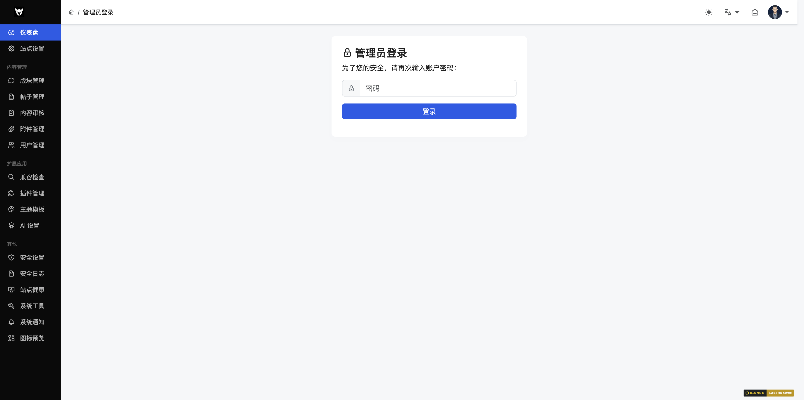

## 十五、后台登录

### 页面信息
- **页面名称**：后台登录
- **路径**：`/admin/?index-login.htm`
- **功能说明**：管理员身份验证入口，需输入管理员密码才能进入后台

### 操作步骤
1. 访问 `/admin/` 目录，系统自动跳转到登录页面
2. 在密码输入框中输入管理员密码
3. 点击「登录」按钮提交

### 字段说明
| 字段 | 类型 | 必填 | 说明 |
|------|------|------|------|
| 密码 | password | 是 | 管理员账号的登录密码 |

### 注意事项
- 后台登录使用与前台一致的密码验证逻辑
- 登录失败会显示错误提示
- 登录成功后自动跳转到后台首页

---

