## 一、设置

### 1.1 基础设置

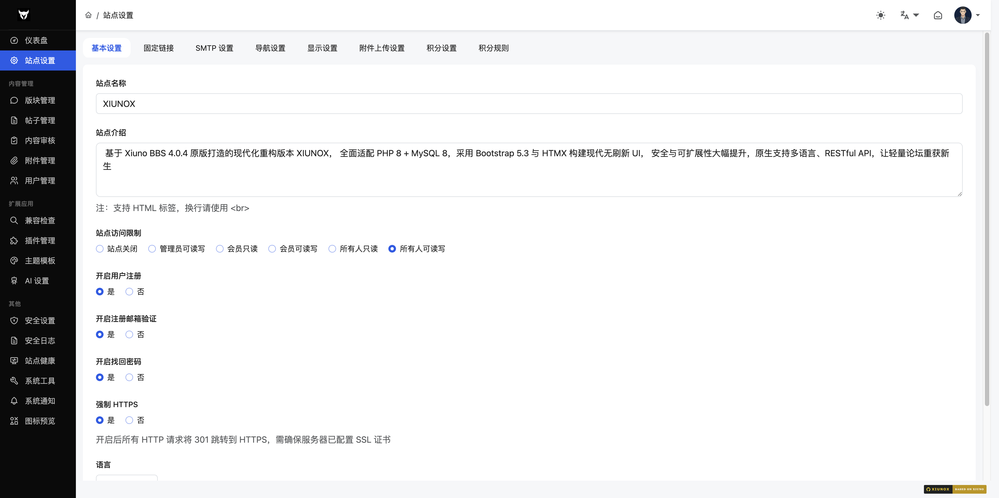

**路径**：`/admin/?setting-base.htm`

**功能说明**：配置站点的基本信息、运行模式和功能开关。

#### 操作步骤
1. 在左侧菜单选择「设置」→「基础设置」
2. 修改各项配置
3. 点击「确认」按钮保存

#### 字段说明
| 字段 | 类型 | 说明 |
|------|------|------|
| 站点名称 | text | 网站名称，显示在浏览器标题栏和页面头部 |
| 站点描述 | textarea | 网站简介，用于 SEO 和页面展示 |
| 运行模式 | radio | 站点运行级别（如正常运营、维护模式等） |
| 允许注册 | radio | 是否开放新用户注册 |
| 邮箱注册 | radio | 注册时是否需要邮箱验证 |
| 密码找回 | radio | 是否允许用户通过邮箱找回密码 |
| 禁用缓存 | radio | 是否禁用站点缓存（调试时使用） |
| 语言 | select | 站点界面语言 |

#### 注意事项
- 禁用缓存会影响性能，仅建议在调试时开启
- 关闭注册后新用户将无法创建账号

---

### 1.2 永久链接

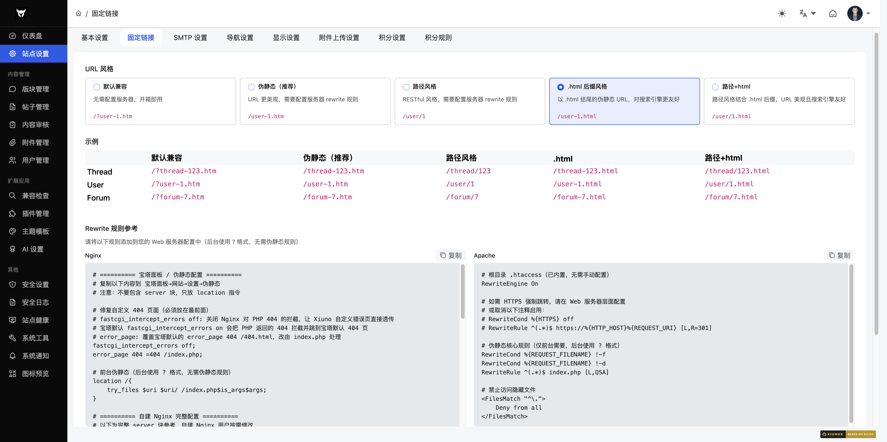

**路径**：`/admin/?setting-permalink.htm`

**功能说明**：配置 URL 重写规则，控制前台页面的 URL 格式。

#### 操作步骤
1. 选择 URL 风格（默认兼容 / 伪静态 / 路径风格）
2. 如选择伪静态或路径风格，页面会显示对应的 Nginx/Apache Rewrite 规则
3. 将 Rewrite 规则配置到 Web 服务器
4. 可勾选「跳过检测」（如果确认服务器已配置好 Rewrite）
5. 点击「确认」保存

#### URL 风格对比
| 页面 | 默认兼容 | 伪静态 | 路径风格 |
|------|----------|--------|----------|
| 帖子 | `/?thread-123.htm` | `/thread-123.htm` | `/thread/123` |
| 用户 | `/?user-1.htm` | `/user-1.htm` | `/user/1` |
| 版块 | `/?forum-7.htm` | `/forum-7.htm` | `/forum/7` |

#### 字段说明
| 字段 | 类型 | 说明 |
|------|------|------|
| URL 风格 | radio | 默认兼容（0）、伪静态（1）、路径风格（3） |
| 跳过检测 | checkbox | 跳过服务器 Rewrite 功能检测 |

#### 注意事项
- 切换 URL 风格后，必须在 Web 服务器配置对应的 Rewrite 规则，否则页面将无法访问
- 页面提供了 Nginx 和 Apache 两种规则，可点击复制按钮一键复制
- 建议先在测试环境验证 Rewrite 规则后再上线

---

### 1.3 AI 设置

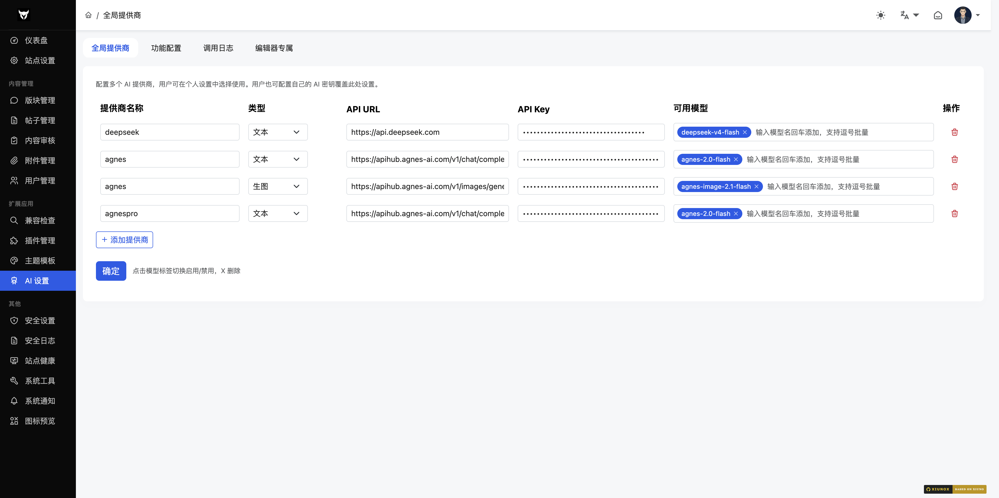

AI 模块位于后台「扩展」分组下，是单一菜单项（图标 `ti-robot`），包含 4 个 tab 页面：服务商管理、功能配置、编辑器提示词、调用日志。

#### 1.3.1 AI 服务商管理

**路径**：`/admin/?ai-providers.htm`（默认 tab）

**功能说明**：管理 AI 服务商库，可添加/编辑/删除服务商及其模型，支持文本、图像、视频、音频、转录 5 种类型。

**字段说明**
| 字段 | 类型 | 说明 |
|------|------|------|
| 服务商名称 | text | 自定义服务商标识 |
| 类型 | select | text / image / video / audio / transcription |
| API URL | text | 服务商接口地址 |
| API Key | password | 服务商密钥 |
| 模型列表 | text（逗号分隔） | 该服务商支持的模型名 |

**预设服务商**（5 个，预置 2026 主流 AI 厂商，API Key 留空由管理员填写）

| 服务商 | API URL | 默认模型 |
|--------|---------|----------|
| OpenAI | https://api.openai.com | gpt-4o, gpt-4o-mini, gpt-4-turbo |
| DeepSeek | https://api.deepseek.com | deepseek-chat, deepseek-reasoner |
| 智谱 GLM | https://open.bigmodel.cn/api/paas/v4 | glm-4-plus, glm-4-flash, glm-4-air |
| Kimi（月之暗面） | https://api.moonshot.cn | moonshot-v1-8k/32k/128k |
| 通义千问 | https://dashscope.aliyuncs.com/compatible-mode | qwen-max, qwen-plus, qwen-turbo |

#### 1.3.2 AI 功能配置

**路径**：`/admin/?ai-features.htm`

**功能说明**：为每个 AI 功能选择默认服务商和模型，并配置允许使用的服务商范围。

| 字段 | 类型 | 说明 |
|------|------|------|
| 功能模式 | select | global（用全局服务商）/ user_key（用用户自己的 Key）/ both（二者皆可） |
| 默认服务商 | select | 该功能的默认 AI 服务商 |
| 默认模型 | select | 该功能的默认模型名 |
| 允许的服务商 | checkbox | 该功能可切换的服务商白名单 |

#### 1.3.3 编辑器提示词

**路径**：`/admin/?ai-editor.htm`

**功能说明**：配置发帖编辑器中 AI 续写和 AI 优化的系统提示词。

| 字段 | 类型 | 说明 |
|------|------|------|
| 续写提示词 | textarea | AI 续写功能的系统提示词 |
| 优化提示词 | textarea | AI 内容优化功能的系统提示词 |

#### 1.3.4 AI 调用日志

**路径**：`/admin/?ai-logs.htm`

**功能说明**：查看 AI 调用记录，含今日统计概览（调用次数/Token 消耗/响应时间）。

**筛选条件**：来源、功能、状态

**日志字段**：UID、功能、服务商、模型、状态、Token 数、响应时间、错误信息

---

### 1.4 SMTP 设置

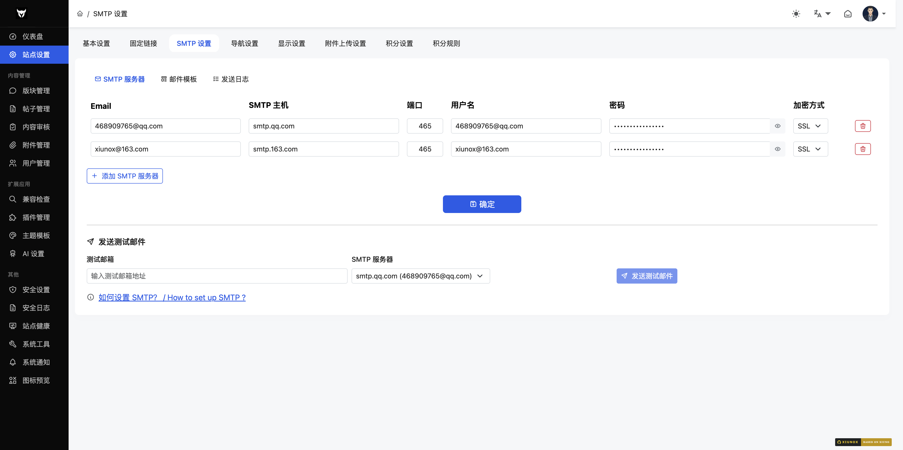

**路径**：`/admin/?setting-smtp.htm`

**功能说明**：配置邮件服务器、邮件模板和查看发送日志。页面包含三个子标签页。

#### 标签页 1：SMTP 服务器配置

**操作步骤**
1. 填写或修改 SMTP 服务器信息
2. 点击「添加服务器」按钮可新增 SMTP 服务器
3. 点击行末的删除按钮可移除服务器
4. 点击「确认」保存配置

**字段说明**
| 字段 | 类型 | 说明 |
|------|------|------|
| 邮箱 | text | 发件人邮箱地址 |
| SMTP 主机 | text | SMTP 服务器地址 |
| 端口 | text | SMTP 端口（SSL 默认 465，TLS 默认 587，无加密默认 25） |
| 用户名 | text | SMTP 认证用户名 |
| 密码 | password | SMTP 认证密码，可点击眼睛图标切换显示 |
| 加密方式 | select | 无加密 / SSL / TLS，切换时自动更新端口 |

**测试邮件**
- 在页面下方可输入测试邮箱地址，选择 SMTP 服务器后发送测试邮件
- 发送结果会实时显示在页面上

#### 标签页 2：邮件模板

**操作步骤**
1. 修改各模板的邮件主题和正文
2. 点击「保存模板」按钮

**模板类型**
| 模板 | 说明 |
|------|------|
| 注册验证码 | 用户注册时发送的验证码邮件 |
| 密码重置验证码 | 用户找回密码时发送的验证码邮件 |
| 邮箱变更验证码 | 用户修改邮箱时发送的验证码邮件 |

**可用变量**：`{code}`（验证码）、`{sitename}`（站点名称）、`{username}`（用户名）

#### 标签页 3：发送日志

**功能说明**：查看邮件发送记录，支持按状态筛选（全部/成功/失败）。

**日志字段**：ID、收件人、主题、SMTP 服务器、状态、时间、错误信息

---

### 1.5 导航设置

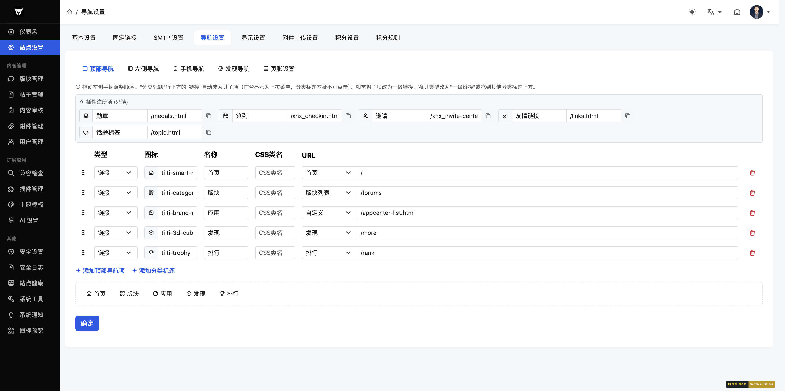

**路径**：`/admin/?setting-nav.htm`

**功能说明**：配置前台顶部导航栏、左侧导航栏和页脚信息。页面包含三个子标签页。

#### 标签页 1：顶部导航

**操作步骤**
1. 在表格中编辑导航项的图标、名称、Slug、URL 和排序
2. 点击「添加顶部导航项」新增导航
3. 点击行末删除按钮移除导航
4. 图标字段点击可打开 Tabler Icons 图标选择器

**字段说明**
| 字段 | 类型 | 说明 |
|------|------|------|
| 图标 | text（图标选择器） | 导航项图标，使用 Tabler Icons 类名 |
| 名称 | text | 导航项显示名称 |
| Slug | text | 导航项标识符 |
| URL | text | 导航项链接地址 |
| 排序 | number | 排序权重，数值越小越靠前 |

#### 标签页 2：左侧导航

**操作步骤**
1. 左侧导航支持两种类型：**链接**和**分类标题**
2. 点击「添加侧边导航项」添加链接类型
3. 点击「添加分类标题」添加标题类型
4. 切换类型时，分类标题会自动隐藏图标、Slug、URL 字段

**字段说明**
| 字段 | 类型 | 说明 |
|------|------|------|
| 类型 | select | 链接（有图标、名称、Slug、URL）或分类标题（仅名称） |
| 图标 | text（图标选择器） | 链接类型的图标（分类标题时隐藏） |
| 名称 | text | 导航项显示名称 |
| Slug | text | 导航项标识符（分类标题时隐藏） |
| URL | text | 导航项链接地址（分类标题时隐藏） |
| 排序 | number | 排序权重 |

**排序规则**：先按 rank 升序排列，rank 相同时分类标题排在链接前面。

#### 标签页 3：页脚设置

**字段说明**
| 字段 | 类型 | 说明 |
|------|------|------|
| ICP 备案号 | text | 网站备案号 |
| 公安备案号 | text | 公安备案号 |
| 公安备案链接 | text | 公安备案查询链接 |

---

### 1.6 展示设置

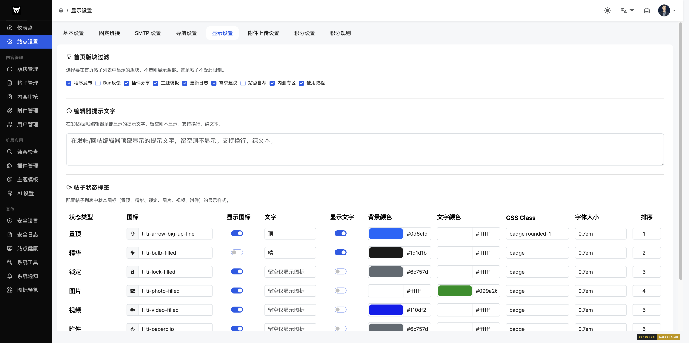

**路径**：`/admin/?setting-display.htm`

**功能说明**：配置前台帖子状态标签的显示样式，包括图标、文字、颜色和排序。

#### 操作步骤
1. 修改各状态类型的图标、文字、显示开关、颜色和排序
2. 点击图标字段可打开 Tabler Icons 图标选择器
3. 背景颜色和文字颜色支持颜色选择器和手动输入 HEX 值
4. 点击「确认」保存

#### 状态类型
| 状态 | 说明 |
|------|------|
| top | 置顶帖 |
| digest | 精华帖 |
| closed | 已关闭 |
| image | 图片帖 |
| video | 视频帖 |
| attachment | 附件帖 |

#### 字段说明
| 字段 | 类型 | 说明 |
|------|------|------|
| 状态类型 | 只读 | 预定义的 6 种状态类型 |
| 图标 | text（图标选择器） | 状态标签图标 |
| 显示图标 | switch | 是否在标签中显示图标 |
| 文字 | text | 状态标签文字 |
| 显示文字 | switch | 是否在标签中显示文字 |
| 背景颜色 | color + text | 标签背景色（HEX） |
| 文字颜色 | color + text | 标签文字色（HEX） |
| 排序 | number | 标签显示顺序 |

---

### 1.7 上传设置

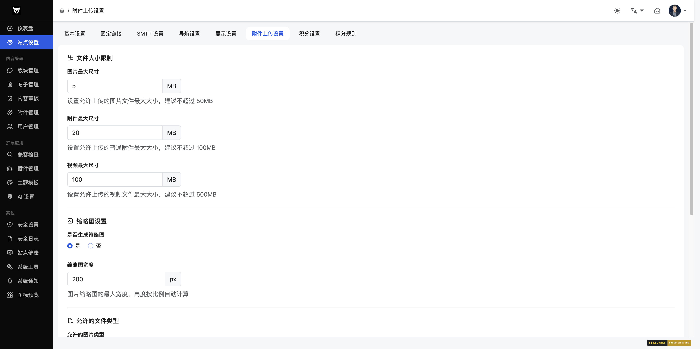

**路径**：`/admin/?setting-upload.htm`

**功能说明**：配置附件上传的大小限制、缩略图、允许的文件类型和存储方式。

#### 操作步骤
1. 设置各类文件大小限制
2. 配置缩略图参数
3. 勾选允许的文件类型
4. 选择存储驱动
5. 点击「确认」保存

#### 字段说明

**文件大小限制**
| 字段 | 类型 | 范围 | 说明 |
|------|------|------|------|
| 图片最大尺寸 | number | 1-100 MB | 上传图片的最大文件大小 |
| 文件最大尺寸 | number | 1-200 MB | 上传普通文件的最大文件大小 |
| 视频最大尺寸 | number | 1-500 MB | 上传视频的最大文件大小 |

**缩略图设置**
| 字段 | 类型 | 说明 |
|------|------|------|
| 启用缩略图 | radio（是/否） | 是否自动生成缩略图 |
| 缩略图宽度 | number（50-1000 px） | 缩略图的目标宽度 |

**文件类型**
- 图片类型：勾选允许的图片扩展名（如 jpg、png、gif、webp 等）
- 视频类型：勾选允许的视频扩展名（如 mp4、avi、webm 等）
- 文件类型：勾选允许的文件扩展名（如 doc、pdf、zip 等）

**存储设置**
| 字段 | 类型 | 说明 |
|------|------|------|
| 存储驱动 | select | 本地存储或 OSS 对象存储 |

---

### 1.8 积分设置

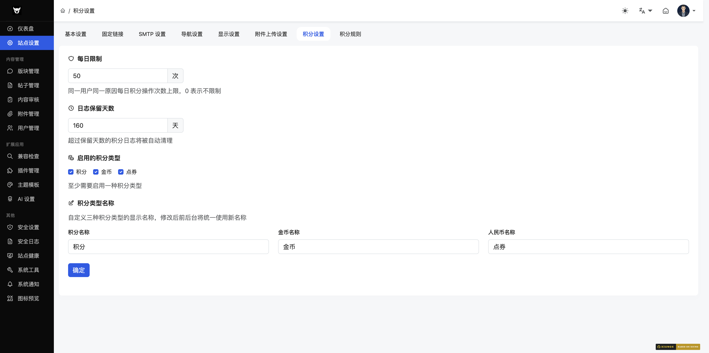

**路径**：`/admin/?setting-credits.htm`

**功能说明**：配置积分系统的全局参数，包括防刷限制、日志保留、积分类型和类型名称。

#### 字段说明

**防刷设置**
| 字段 | 类型 | 说明 |
|------|------|------|
| 每日积分上限 | number（0-9999 次） | 每个用户每天获取积分的次数上限，0 表示不限制 |

**日志设置**
| 字段 | 类型 | 说明 |
|------|------|------|
| 日志保留天数 | number（1-3650 天） | 积分日志的保留期限 |

**积分类型**
| 字段 | 类型 | 说明 |
|------|------|------|
| 启用的积分类型 | checkbox | 勾选启用的积分类型（积分、金币、人民币等） |

**积分类型名称**
| 字段 | 类型 | 说明 |
|------|------|------|
| 积分名称 | text（最长 10 字） | 自定义积分的显示名称 |
| 金币名称 | text（最长 10 字） | 自定义金币的显示名称 |
| 人民币名称 | text（最长 10 字） | 自定义人民币的显示名称 |

---

### 1.9 积分规则

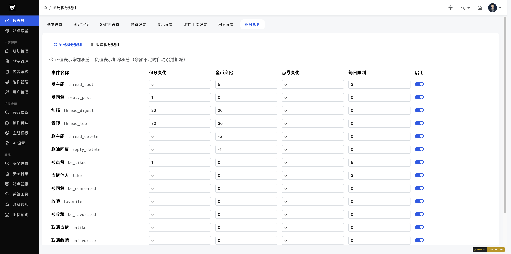

**路径**：`/admin/?credits_rule-global.htm`

**功能说明**：配置积分获取和扣除的规则，支持全局规则和版块级别覆盖。页面包含两个子标签页。

#### 标签页 1：全局规则

**操作步骤**
1. 为每个事件设置积分、金币、人民币的变动值（正数为增加，负数为扣除）
2. 通过开关控制每个事件是否启用
3. 点击「保存规则」按钮

**内置事件**
| 事件 | 说明 |
|------|------|
| thread_post | 发帖 |
| reply_post | 回复 |
| thread_digest | 帖子被加精 |
| thread_top | 帖子被置顶 |
| thread_delete | 帖子被删除 |
| reply_delete | 回复被删除 |
| be_liked | 被点赞 |
| like | 点赞 |
| be_commented | 被评论 |
| favorite | 收藏 |
| be_favorited | 被收藏 |
| daily_login | 每日登录 |

**字段说明**
| 字段 | 类型 | 说明 |
|------|------|------|
| 积分变动 | number（-999~999） | 该事件触发时的积分变化值 |
| 金币变动 | number（-999~999） | 该事件触发时的金币变化值 |
| 人民币变动 | number（-999~999） | 该事件触发时的人民币变化值 |
| 启用 | switch | 是否启用该规则 |

#### 标签页 2：版块覆盖

**操作步骤**
1. 在下拉框中选择目标版块
2. 选择后页面会通过 AJAX 加载该版块的积分规则面板
3. 修改版块级别的积分规则（与全局规则格式相同）
4. 保存

**说明**：版块级别的规则会覆盖全局规则，未设置的版块使用全局规则。

---

### 1.10 邮件模板

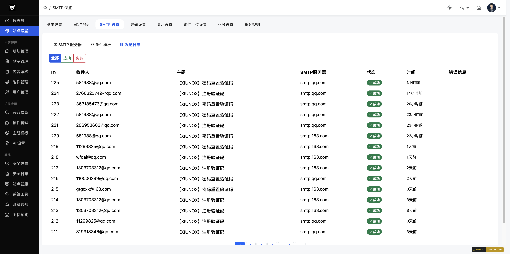

**路径**：`/admin/?setting-email_template.htm`

**功能说明**：独立页面配置各类邮件的内容模板（与 SMTP 设置中的邮件模板标签页功能相同）。

**模板类型和可用变量**：参见 [1.4 SMTP 设置 - 邮件模板](#标签页-2邮件模板)

---

### 1.11 邮件日志

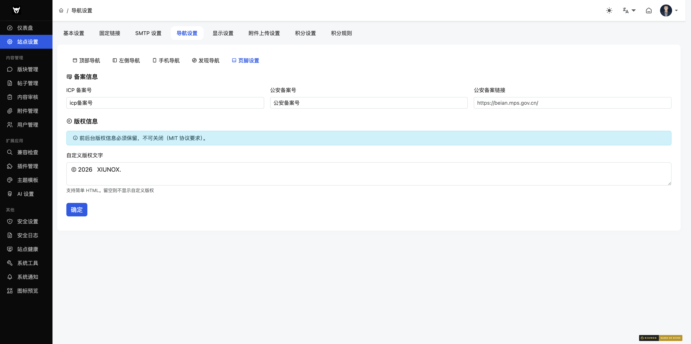

**路径**：`/admin/?setting-email_log.htm`

**功能说明**：独立页面查看邮件发送记录（与 SMTP 设置中的发送日志标签页功能相同）。

**筛选**：支持按状态筛选（全部/成功/失败），支持分页。

---

### 1.12 页脚设置

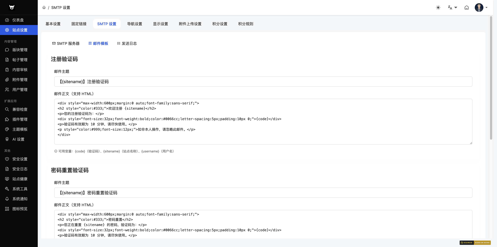

**路径**：`/admin/?setting-footer.htm`

**功能说明**：配置页脚的备案信息、联系方式、页脚导航和版权信息。页面包含四个子标签页。

#### 标签页 1：备案信息
| 字段 | 类型 | 说明 |
|------|------|------|
| ICP 备案号 | text | 工信部备案号 |
| 公安备案号 | text | 公安备案号 |
| 公安备案链接 | text | 公安备案查询 URL |

#### 标签页 2：联系方式
| 字段 | 类型 | 说明 |
|------|------|------|
| 联系邮箱 | email | 站点联系邮箱 |
| 联系电话 | text | 站点联系电话 |
| 联系 QQ | text | 站点联系 QQ 号 |

#### 标签页 3：页脚导航
- 支持动态添加/删除页脚链接
- 每个链接包含名称和 URL 两个字段

#### 标签页 4：版权信息
| 字段 | 类型 | 说明 |
|------|------|------|
| 版权信息 | textarea | 自定义版权文字，支持 HTML 标签 |

---

