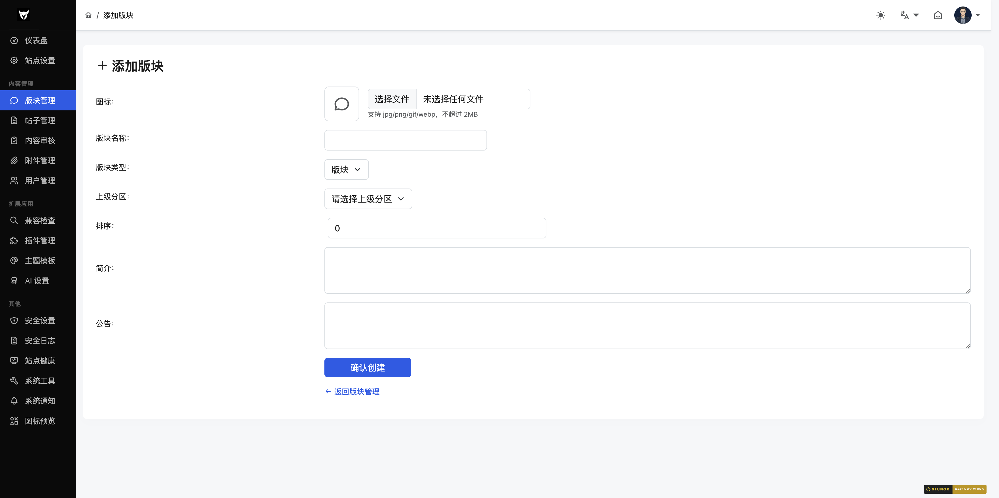
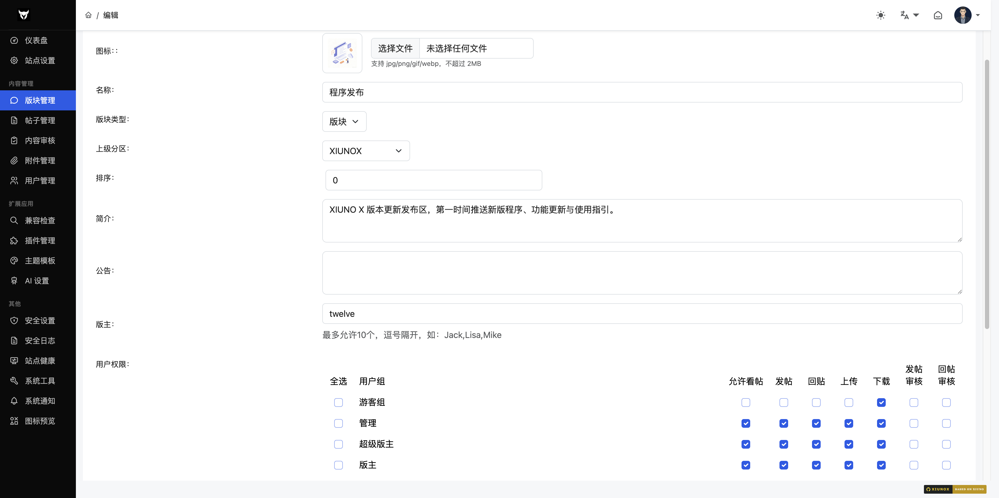
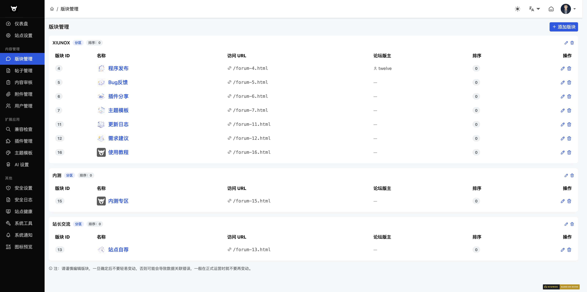

## 二、版块管理

### 2.1 版块列表

**路径**：`/admin/?forum-list.htm`

**功能说明**：管理所有版块，以分区（分类）为分组展示子版块，支持编辑和删除。

#### 操作步骤
1. 查看所有版块，按分区分组展示
2. 点击版块右侧的编辑图标进入编辑页面
3. 点击删除图标弹出确认弹窗后删除版块
4. 点击右上角「添加版块」按钮创建新版块

#### 页面布局
- **分区卡片**：显示分区名称、类型标签（分区）、排序值
- **子版块列表**：分区下的版块，显示图标、名称、排序值
- **未分类版块**：没有归属分区的版块会显示在警告区域

#### 注意事项
- 系统保留版块（fid=1）不可删除
- 删除版块会弹出确认弹窗
- 修改版块后需清理 `tmp/` 缓存

---

### 2.2 创建版块

**路径**：`/admin/?forum-create.htm`

**功能说明**：新建版块或分区。

#### 操作步骤
1. 上传版块图标（可选）
2. 填写版块名称
3. 选择版块类型（版块或分区）
4. 选择上级分区（版块类型时显示，分区类型时隐藏）
5. 设置排序值
6. 填写简介和公告
7. 点击「确认创建」

#### 字段说明
| 字段 | 类型 | 必填 | 说明 |
|------|------|------|------|
| 图标 | file | 否 | 支持 jpg/png/gif/webp 格式 |
| 版块名称 | text | 是 | 版块显示名称 |
| 版块类型 | select | 是 | 版块（0）或分区（1） |
| 上级分区 | select | 否 | 选择所属分区，分区类型时自动隐藏 |
| 排序 | number | 否 | 排序权重，默认 0 |
| 简介 | textarea | 否 | 版块简介 |
| 公告 | textarea | 否 | 版块公告 |

---

### 2.3 编辑版块

**路径**：`/admin/?forum-update-{fid}.htm`

**功能说明**：编辑版块的详细信息和权限配置。

#### 字段说明
| 字段 | 类型 | 说明 |
|------|------|------|
| 图标 | file | 上传新版块图标 |
| 版块名称 | text | 版块显示名称 |
| 版块类型 | select | 版块或分区 |
| 上级分区 | select | 所属分区 |
| 排序 | number | 排序权重 |
| 简介 | textarea | 版块简介 |
| 公告 | textarea | 版块公告 |
| 版主 | text | 版主用户名，多个用逗号分隔 |
| 权限设置 | checkbox 表格 | 按用户组配置权限 |

#### 权限配置
权限表格按用户组分行，每行可配置以下权限：
| 权限 | 说明 |
|------|------|
| 允许浏览 | 是否可查看该版块内容 |
| 允许发帖 | 是否可在该版块发帖 |
| 允许回帖 | 是否可在该版块回复 |
| 允许上传 | 是否可上传附件 |
| 允许下载 | 是否可下载附件 |
| 帖子审核 | 发帖是否需要审核 |
| 回复审核 | 回复是否需要审核 |

**全选功能**：每行首列有全选复选框，可一键勾选/取消该用户组的所有权限。

---

