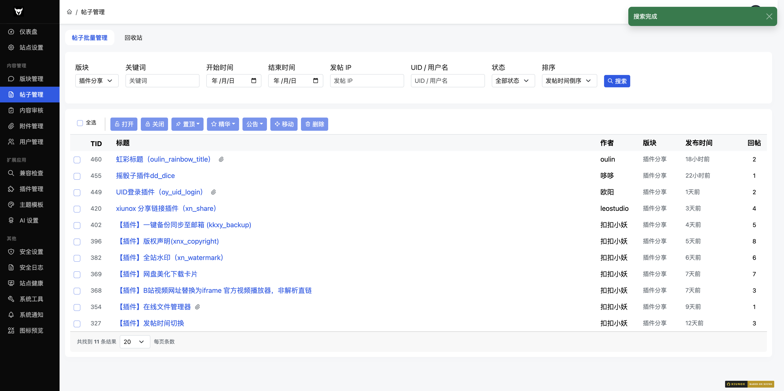
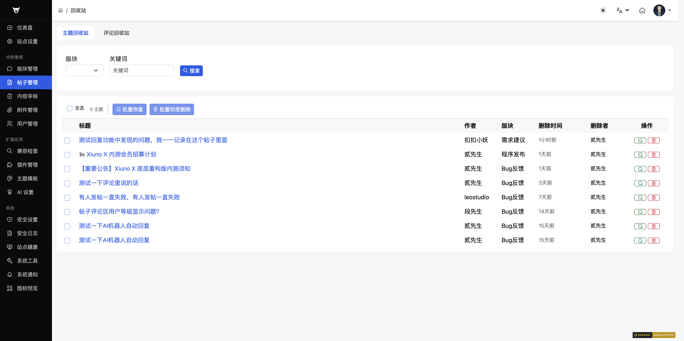
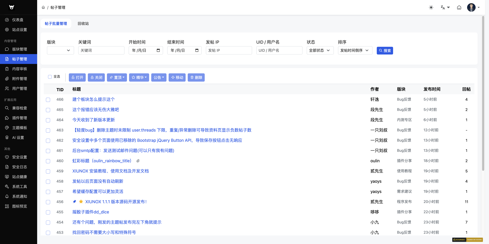

## 三、帖子管理

### 3.1 帖子列表

**路径**：`/admin/?thread-list.htm`

**功能说明**：搜索和管理帖子，支持多条件筛选和批量操作。

#### 搜索条件
| 字段 | 类型 | 说明 |
|------|------|------|
| 版块 | select | 按版块筛选 |
| 关键词 | text | 搜索帖子标题 |
| 开始日期 | date | 发帖起始日期 |
| 结束日期 | date | 发帖截止日期 |
| 用户 IP | text | 按发帖人 IP 筛选 |
| UID/用户名 | text | 按用户 ID 或用户名筛选 |

#### 搜索操作
1. 填写筛选条件
2. 点击「搜索」按钮，系统会扫描所有匹配的帖子
3. 扫描完成后显示搜索结果和总数
4. 可调整每页显示条数（20/50/100/200）

#### 批量操作
选中帖子后可执行以下操作：
| 操作 | 说明 |
|------|------|
| 打开 | 将已关闭的帖子重新打开 |
| 关闭 | 关闭帖子，禁止回复 |
| 置顶 | 将帖子设为置顶 |
| 加精 | 将帖子设为精华 |
| 公告 | 将帖子设为版块公告 |
| 移动 | 将帖子移动到其他版块（需选择目标版块） |
| 删除 | 删除帖子 |

#### 注意事项
- 搜索过程会扫描所有匹配页面，数据量大时可能需要等待
- 批量操作前需先勾选目标帖子
- 移动帖子时需在工具栏中选择目标版块

---

### 3.2 帖子搜索

**路径**：`/admin/?thread-found.htm`

**功能说明**：显示帖子搜索的结果页面，由帖子列表页搜索后自动跳转。

---

### 3.3 帖子回收站

**路径**：`/admin/?thread-recycle.htm`（含主题/回帖双 tab）

**功能说明**：管理已软删除的帖子和回复，支持批量恢复或彻底删除。

**筛选条件**：版块、关键字

**列表字段**：原帖信息、删除时间

**操作**：恢复（还原帖子）、彻底删除（不可恢复）

> 备注：仅在「安全 → 内容权限」开启软删除后，删除的帖子才会进入回收站。

---

