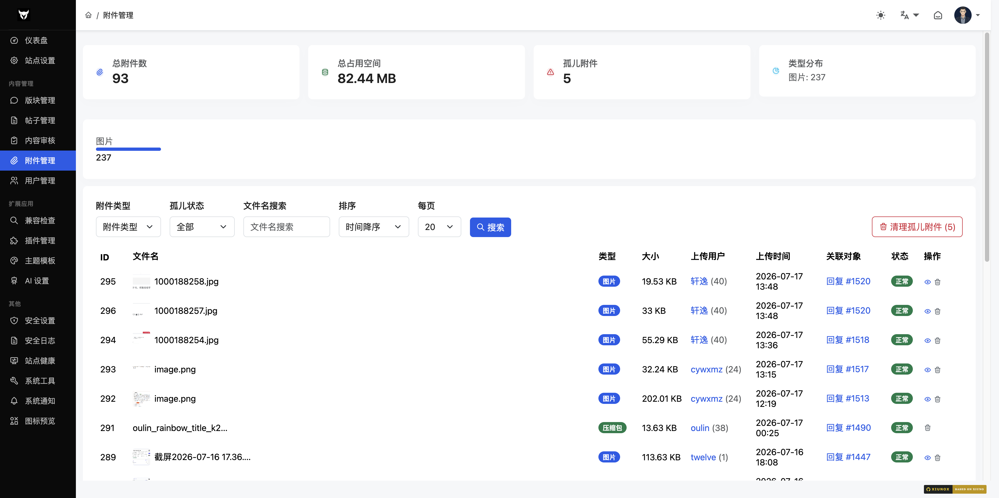

## 四、附件管理

### 4.1 附件列表

**路径**：`/admin/?attach-list.htm`

**功能说明**：管理所有上传的附件，查看统计信息、筛选和清理孤儿附件。

#### 统计仪表
页面顶部显示四个统计卡片：
- 附件总数
- 总占用空间
- 孤儿附件数（关联的帖子/回复已被删除）
- 类型分布（图片/视频/音频/文档/压缩包/其他）

#### 筛选条件
| 字段 | 类型 | 说明 |
|------|------|------|
| 类型 | select | 图片/视频/音频/文档/压缩包/其他 |
| 孤儿 | select | 全部/仅孤儿/仅正常 |
| 关键词 | text | 按文件名搜索 |
| 排序 | select | 日期降序/升序、大小降序/升序 |
| 每页条数 | select | 20/50/100 |

#### 附件列表字段
| 字段 | 说明 |
|------|------|
| ID | 附件 ID |
| 文件名 | 原始文件名，图片类型显示缩略图 |
| 类型 | 文件类型标签（图片/视频/音频/文档/压缩包/其他） |
| 大小 | 文件大小 |
| 用户 | 上传者 |
| 时间 | 上传时间 |
| 关联 | 关联的帖子或回复链接 |
| 状态 | 正常或孤儿 |
| 操作 | 预览（可预览的文件）/ 删除 |

#### 清理孤儿附件
- 页面右侧有「清理孤儿附件」按钮，显示当前孤儿数量
- 点击后可批量清理无关联的附件

---

