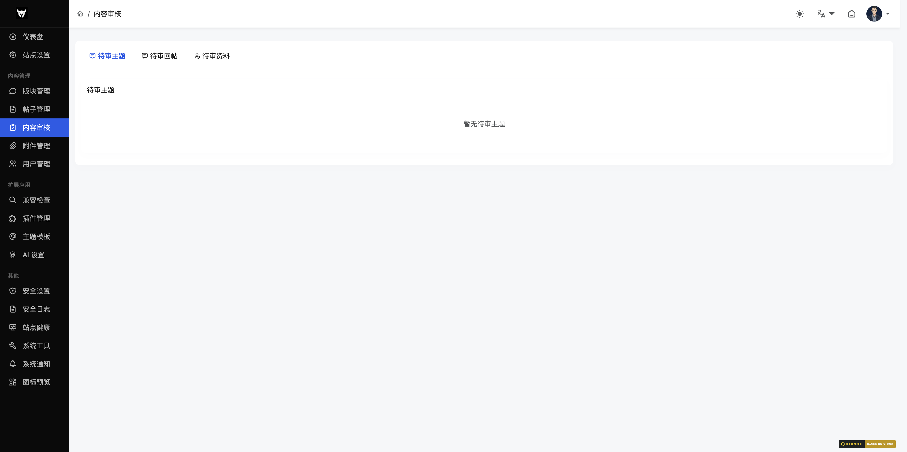

## 五、内容审核

### 5.1 内容审核

**路径**：`/admin/?audit.htm`（一级菜单，含 3 个 tab）

**功能说明**：管理待审核的帖子、回复和用户资料变更。待审数量会在 sidebar 菜单显示 badge 提示。

#### 标签页 1：待审主题
- 显示待审核的帖子列表（标题、作者、版块）
- 支持「通过」和「拒绝」操作
- 支持全选和批量通过

#### 标签页 2：待审回复
- 显示待审核的回复列表（内容摘要、作者、所属帖子）
- 支持「通过」和「拒绝」操作
- 支持全选和批量通过

#### 标签页 3：待审资料
- 显示待审核的用户资料变更（头像、签名、用户名）
- 显示变更前后的对比
- 支持「通过」和「拒绝」操作
- 支持全选和批量通过

**拒绝操作**：拒绝时会弹出输入框，可填写拒绝原因。

**审核日志**：页面底部显示最近的审核操作记录（操作人、类型、目标 ID、操作、原因、时间）。

> 备注：原 `security-audit.htm` 已废弃（与 `audit.htm` 内容相同），现统一使用一级菜单 `audit.htm`。友情链接已插件化（`plugin/xnx_friendlink/`），不在核心后台。

---

