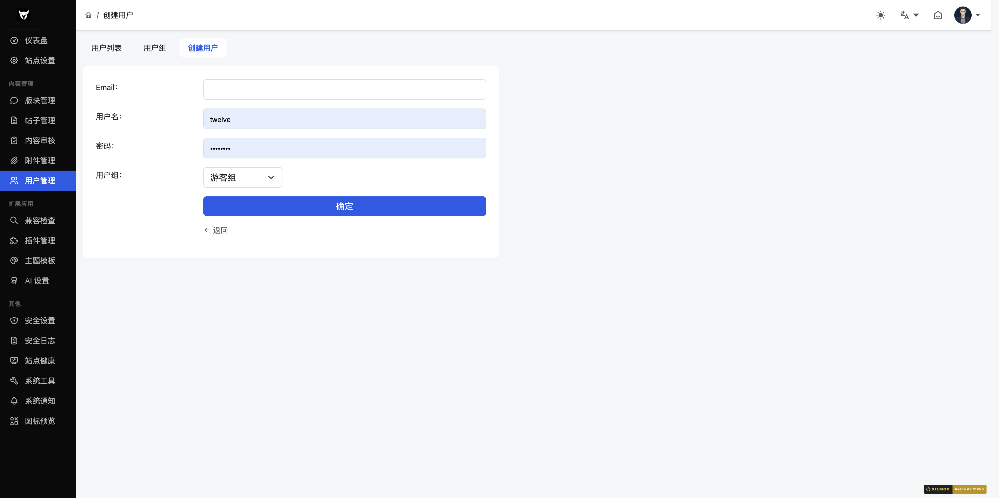
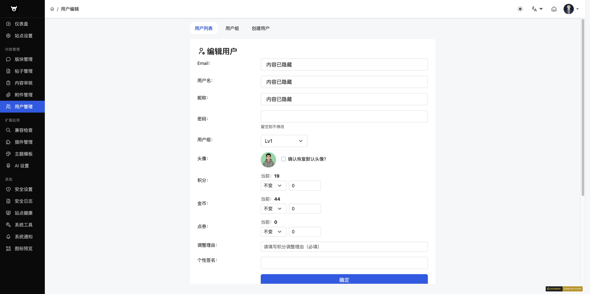
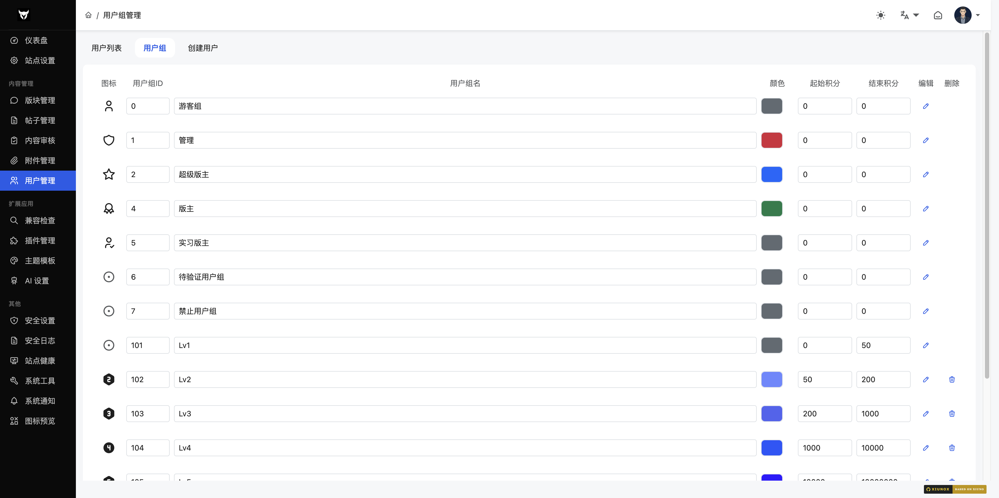
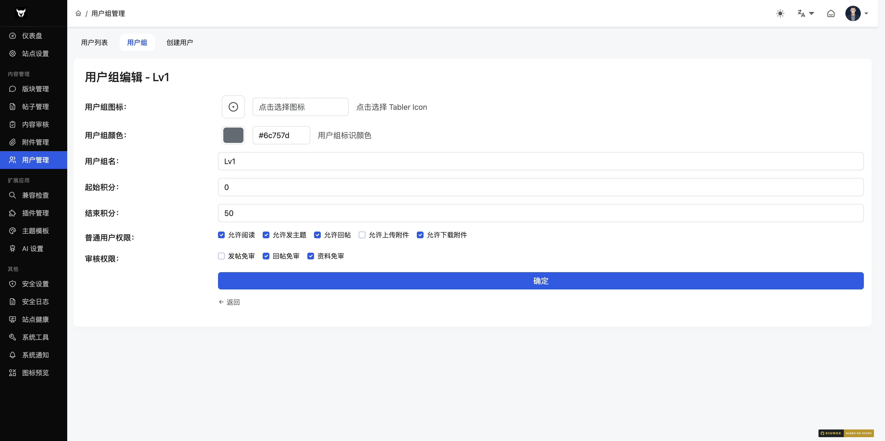
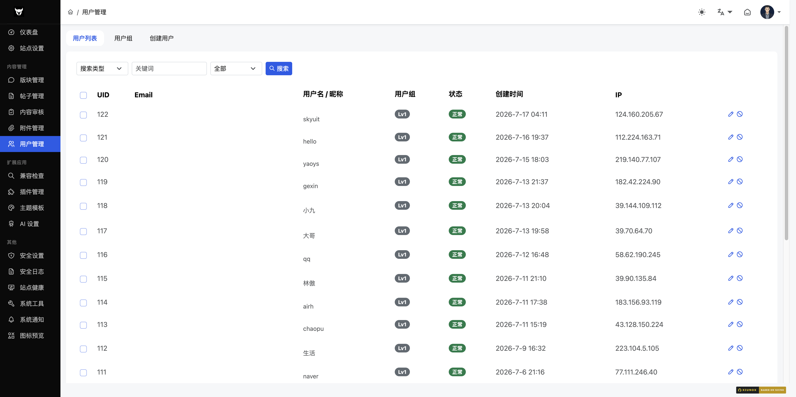
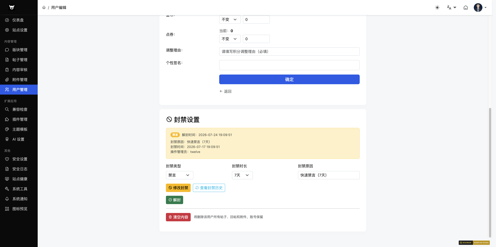

## 六、用户管理

### 6.1 用户列表

**路径**：`/admin/?user-list.htm`

**功能说明**：查看和管理所有用户，支持搜索和批量删除。

#### 搜索条件
| 字段 | 类型 | 说明 |
|------|------|------|
| 搜索类型 | select | UID / 用户名 / 邮箱 / 用户组 / 注册 IP |
| 关键词 | text | 搜索关键词 |

#### 用户列表字段
| 字段 | 说明 |
|------|------|
| 复选框 | 用于批量选择 |
| UID | 用户 ID |
| 邮箱 | 用户邮箱 |
| 用户名 | 用户名 |
| 用户组 | 用户所属组（带颜色标签） |
| 注册日期 | 用户注册时间 |
| IP | 注册 IP（可点击查看归属地） |
| 操作 | 编辑按钮 |

#### 批量删除
1. 勾选要删除的用户
2. 点击底部「删除」按钮
3. 在确认弹窗中确认删除

**注意**：UID 为 1 的管理员账号不可删除。

---

### 6.2 创建用户

**路径**：`/admin/?user-create.htm`

**功能说明**：管理员手动创建新用户。

#### 字段说明
| 字段 | 类型 | 必填 | 说明 |
|------|------|------|------|
| 邮箱 | text | 是 | 用户邮箱 |
| 用户名 | text | 是 | 用户名 |
| 密码 | password | 是 | 登录密码 |
| 用户组 | select | 是 | 选择用户组 |

---

### 6.3 编辑用户

**路径**：`/admin/?user-update-{uid}.htm`

**功能说明**：编辑用户信息。

#### 字段说明
| 字段 | 类型 | 说明 |
|------|------|------|
| 邮箱 | text | 用户邮箱 |
| 用户名 | text | 用户名 |
| 密码 | password | 留空则不修改密码 |
| 用户组 | select | 修改用户所属组 |

---

### 6.4 用户组管理

**路径**：`/admin/?group-list.htm`

**功能说明**：管理用户组，配置组名、颜色、积分区间。

#### 操作步骤
1. 在列表中编辑用户组的 GID、名称、颜色、积分区间
2. 点击「添加新行」新增用户组
3. 点击编辑图标进入用户组详情页
4. 点击删除图标移除用户组（系统保留组不可删除）
5. 点击「确认」保存

#### 字段说明
| 字段 | 类型 | 说明 |
|------|------|------|
| 图标 | 只读 | 用户组图标 |
| GID | number | 用户组 ID |
| 组名 | text | 用户组名称 |
| 颜色 | color | 用户组标签颜色 |
| 积分起始 | number | 该组的最低积分 |
| 积分截止 | number | 该组的最高积分 |

---

### 6.5 编辑用户组

**路径**：`/admin/?group-update-{gid}.htm`

**功能说明**：编辑用户组的详细信息和权限配置。

#### 字段说明
| 字段 | 类型 | 说明 |
|------|------|------|
| 组图标 | text（图标选择器） | 使用 Tabler Icons 选择组图标 |
| 组颜色 | color + text | 用户组标签颜色 |
| 组名 | text | 用户组名称 |
| 积分起始 | number | 该组的最低积分 |
| 积分截止 | number | 该组的最高积分 |

#### 权限配置
权限按分组展示（如基本权限、内容权限、管理权限等），每个权限项为复选框。

**注意**：管理权限仅对 GID 1-5 的用户组显示。

---

### 6.6 用户封禁日志

**路径**：`/admin/?user-ban_log-{uid}.htm`（从用户编辑页跳入）

**功能说明**：查看单个用户的封禁历史记录，展示时间、动作（封禁/解封）、封禁类型、时长、原因、操作管理员。

---

