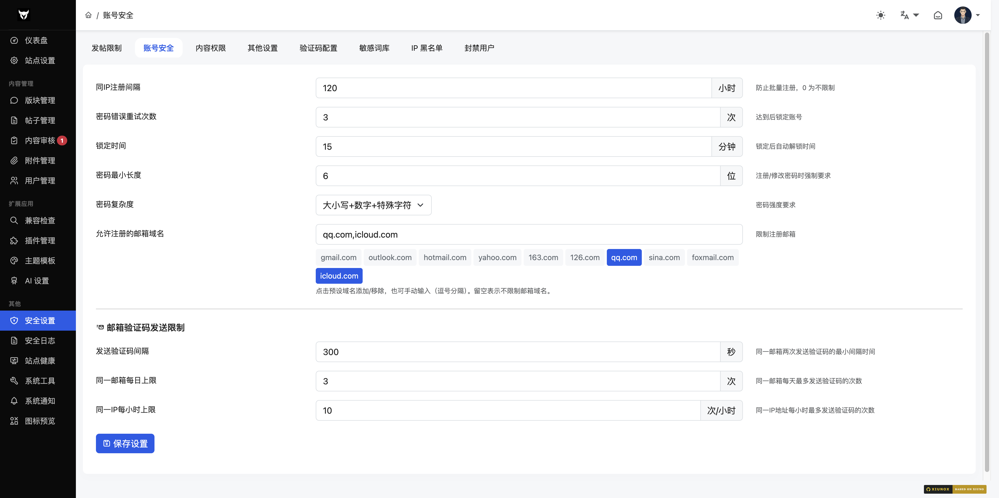
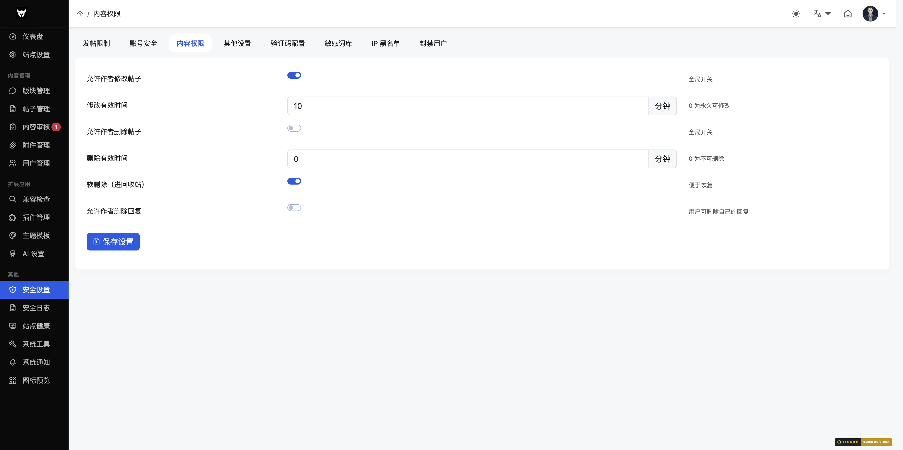
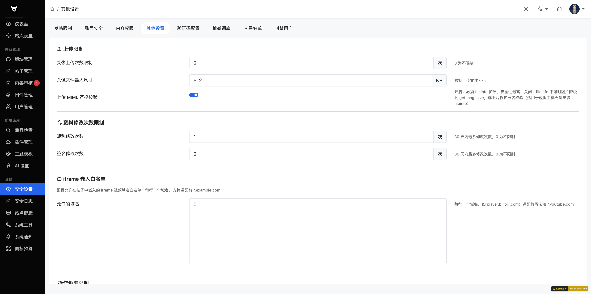
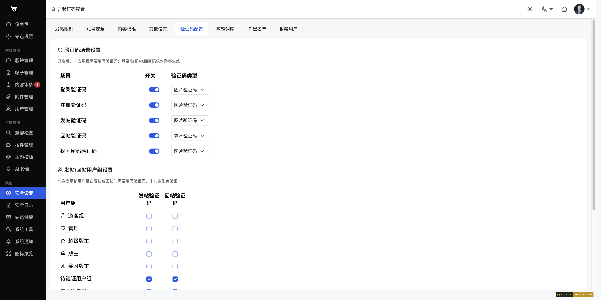
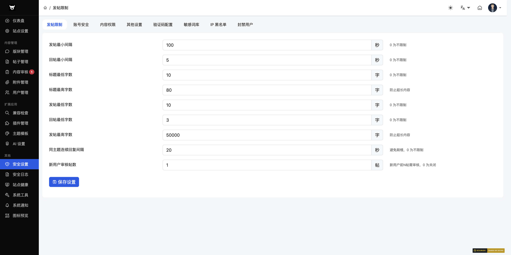
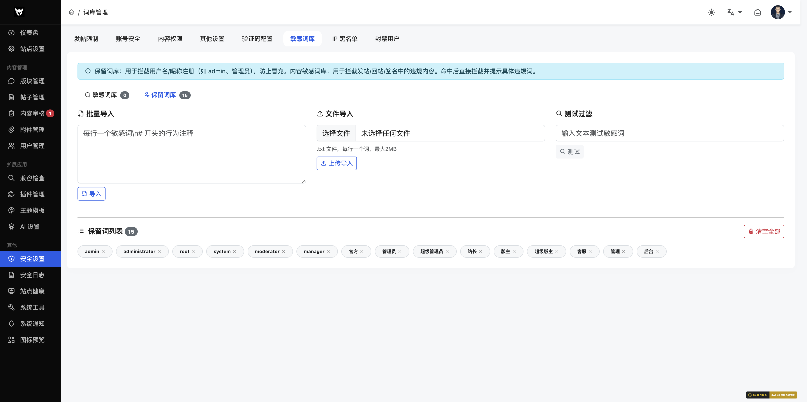
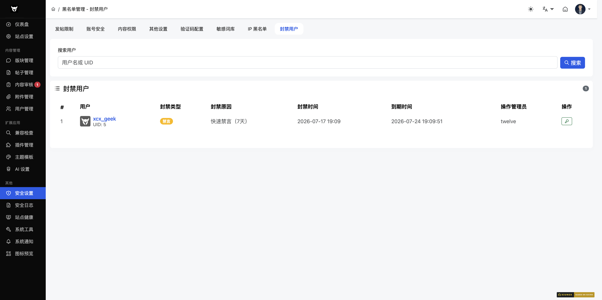
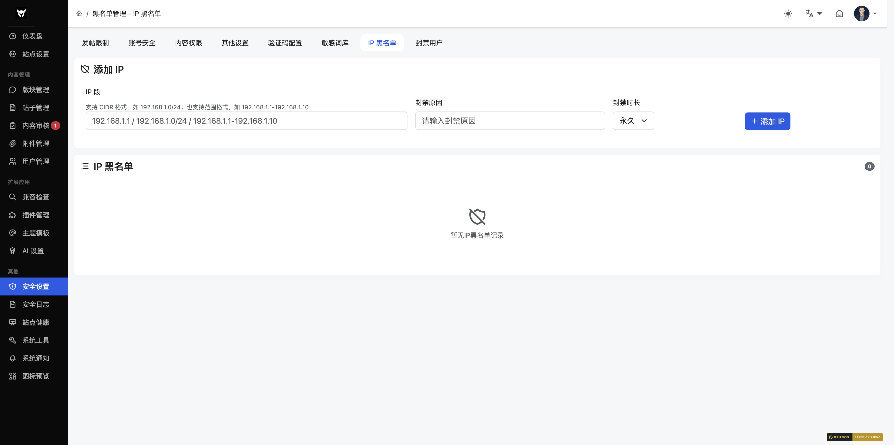

## 七、安全

### 7.1 发帖限制

**路径**：`/admin/?security-post_limit.htm`

**功能说明**：配置发帖和回复的频率与字数限制。

| 字段 | 类型 | 单位 | 说明 |
|------|------|------|------|
| 发帖最小间隔 | number | 秒 | 两次发帖之间的最小间隔，0 不限制 |
| 回复最小间隔 | number | 秒 | 两次回复之间的最小间隔，0 不限制 |
| 发帖最少字数 | number | 字 | 帖子内容的最少字数，0 不限制 |
| 回复最少字数 | number | 字 | 回复内容的最少字数，0 不限制 |
| 发帖最多字数 | number | 字 | 帖子内容的最多字数 |
| 同帖回复间隔 | number | 秒 | 同一帖子内两次回复的间隔，防止灌水 |
| 新用户审核条数 | number | 帖 | 新注册用户前 N 条帖子需审核 |

> 备注：原 `security-protection.htm` 已 301 重定向至本页，旧聚合页下线。

---

### 7.2 账号安全

**路径**：`/admin/?security-account.htm`

**功能说明**：配置账号注册、登录、密码策略相关设置。

| 字段 | 类型 | 单位 | 说明 |
|------|------|------|------|
| IP 注册间隔 | number | 小时 | 同一 IP 两次注册的间隔，防止批量注册 |
| 密码最大重试次数 | number | 次 | 密码错误达到次数后锁定账号 |
| 锁定时长 | number | 分钟 | 账号锁定后的自动解锁时间 |
| 密码最小长度 | number | 位 | 密码的最少字符数 |
| 密码复杂度 | select | - | 无限制 / 必须包含数字 / 必须包含大小写 / 必须包含特殊字符 |
| 允许的邮箱域名 | text | - | 限制注册邮箱域名，逗号分隔；提供预设域名快捷按钮 |

---

### 7.3 内容权限

**路径**：`/admin/?security-content.htm`

**功能说明**：配置用户对帖子/回复的编辑和删除权限。

| 字段 | 类型 | 说明 |
|------|------|------|
| 允许编辑帖子 | switch | 全局开关，是否允许用户编辑自己的帖子 |
| 编辑时限 | number（分钟） | 发帖后允许编辑的时间，0 表示始终可编辑 |
| 允许删除帖子 | switch | 全局开关，是否允许用户删除自己的帖子 |
| 删除时限 | number（分钟） | 发帖后允许删除的时间，0 表示不可删除 |
| 软删除 | switch | 删除时是否使用软删除（标记删除而非物理删除），便于恢复 |
| 允许删除回复 | switch | 是否允许用户删除自己的回复 |

---

### 7.4 其他安全设置

**路径**：`/admin/?security-other.htm`

**功能说明**：配置头像、资料、iframe、搜索、Cookie 等杂项安全设置。

| 字段 | 类型 | 单位 | 说明 |
|------|------|------|------|
| 头像上传限制 | number | 次 | 头像上传频率限制，0 不限制 |
| 头像最大尺寸 | number | KB | 头像文件的最大大小 |
| 搜索间隔 | number | 秒 | 两次搜索之间的最小间隔 |
| 搜索需登录 | switch | - | 是否要求登录后才能使用搜索功能 |
| 搜索最小字数 | number | 字 | 搜索关键词最小长度 |

---

### 7.5 验证码设置

**路径**：`/admin/?security-captcha.htm`

**功能说明**：配置各场景的验证码启用状态和类型。

#### 场景配置
| 场景 | 说明 |
|------|------|
| 登录 | 用户登录时 |
| 注册 | 用户注册时 |
| 发帖 | 用户发帖时 |
| 找回密码 | 用户找回密码时 |

#### 每个场景的配置项
| 字段 | 类型 | 说明 |
|------|------|------|
| 启用 | switch | 是否在该场景启用验证码 |
| 类型 | select | 图片验证码（gd_image）或数学运算验证码（gd_math） |

---

### 7.6 敏感词设置

**路径**：`/admin/?security-words.htm`

**功能说明**：管理敏感词库，支持批量导入、文件导入和测试过滤。

#### 操作区域

**批量导入**
1. 在文本框中输入敏感词（每行一个）
2. 点击「导入」按钮

**文件导入**
1. 选择 .txt 文件（每行一个敏感词）
2. 点击「上传导入」按钮

**测试过滤**
1. 在输入框中输入测试文本
2. 点击「测试」按钮
3. 系统会显示命中的敏感词

#### 敏感词列表
- 以标签形式展示所有敏感词
- 每个标签右侧有删除按钮
- 页面顶部显示敏感词总数
- 支持「清空全部」操作

---

### 7.7 封禁用户列表

**路径**：`/admin/?security-banned_user.htm`（security tab 子页）

**功能说明**：查看所有被封禁的用户列表，支持关键字搜索。

**列表字段**：用户、封禁类型、原因、封禁时间、到期时间、操作管理员

---

### 7.8 黑名单

**路径**：`/admin/?security-blacklist.htm`

**功能说明**：管理 IP 黑白名单和邮箱域名黑名单。页面包含两个子标签页。

#### 标签页 1：IP 黑白名单

**IP 黑名单**
- 添加：输入 IP 或 CIDR（如 `192.168.1.0/24`）和备注，点击添加
- 删除：点击列表项右侧的删除按钮
- 黑名单中的 IP 将被禁止访问

**IP 白名单**
- 添加：输入 IP 或 CIDR 和备注，点击添加
- 删除：点击列表项右侧的删除按钮
- 白名单中的 IP 即使在黑名单中也可访问（白名单优先）

#### 标签页 2：邮箱域名黑名单

**添加域名**
- 输入域名（如 `spam.com`），点击添加

**批量导入**
- 在文本框中输入域名（每行一个），点击导入

**文件导入**
- 选择 .txt 文件上传

**域名列表**
- 以标签形式展示，每个标签右侧有删除按钮

**说明**：使用黑名单域名的邮箱将无法注册。

---

