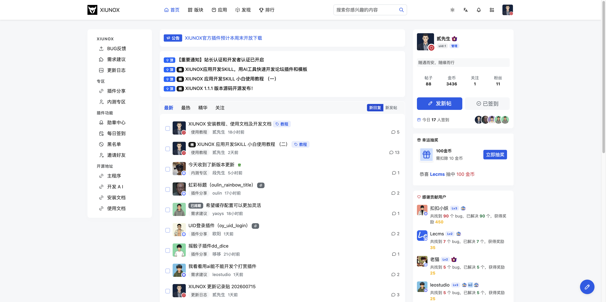
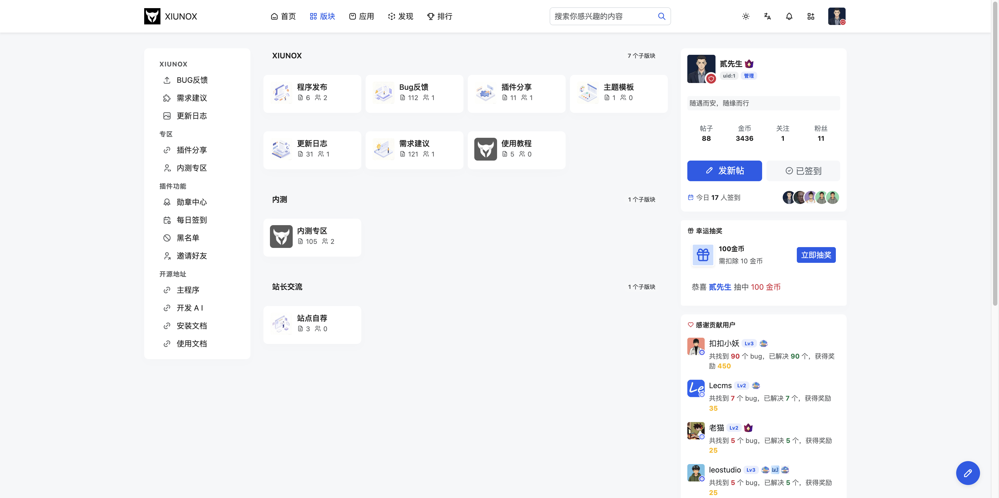
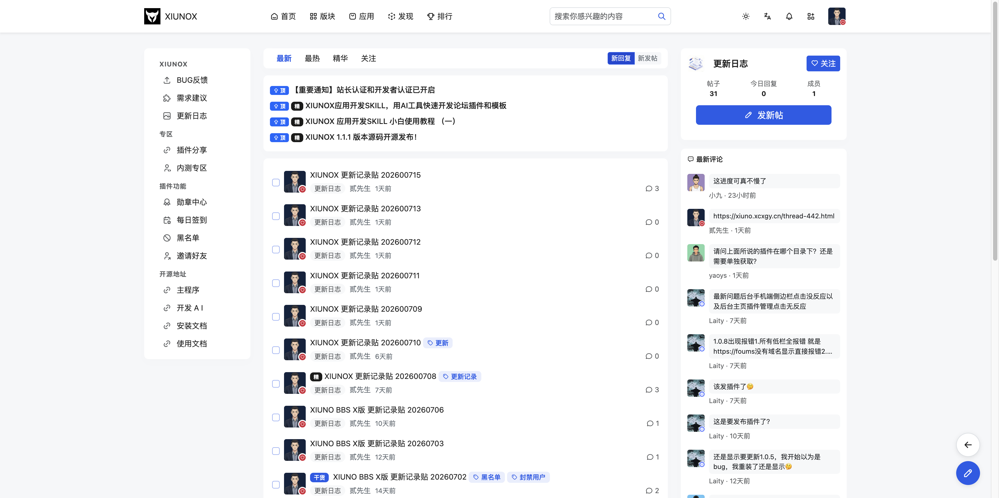
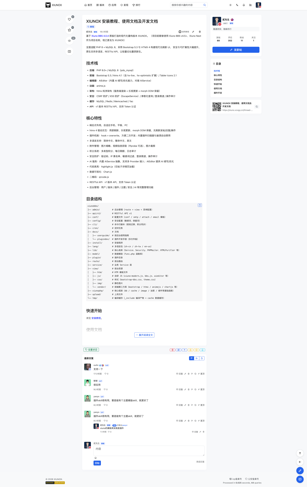
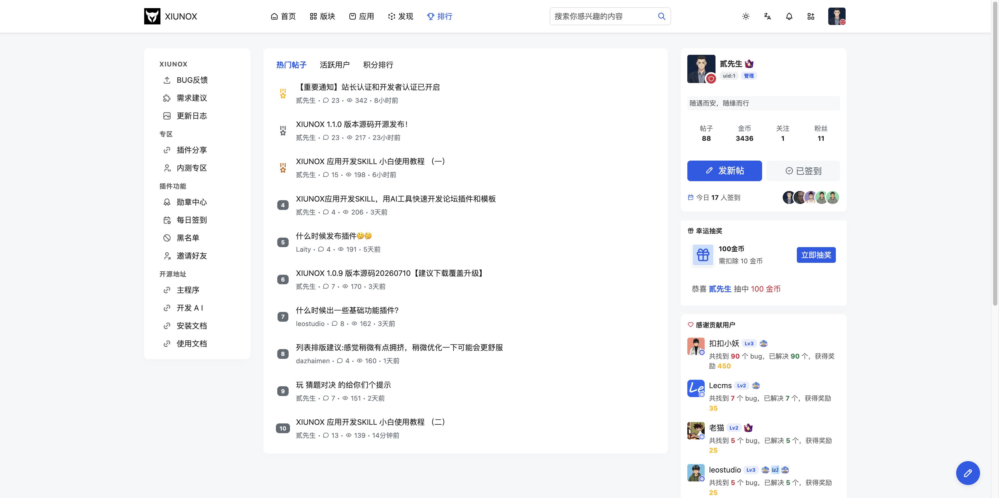

## 一、首页与浏览

### 1.1 首页

**页面路径：** `/`

**功能说明：**
论坛首页，展示全站公告、最新帖子列表，是用户进入论坛后的默认页面。页面采用三栏布局：左侧导航栏、中间内容区、右侧信息栏。

**页面组成：**

| 区域 | 说明 |
|------|------|
| 公告栏 | 顶部滚动展示系统公告帖，自动轮播，每3秒切换一条 |
| 帖子标签页 | 提供「最新」「最热」「精华」「关注」四个排序选项 |
| 视图切换 | 支持列表视图、朋友圈视图（Timeline）、瀑布流视图（Masonry）三种展示模式 |
| 帖子列表 | 按选中排序方式展示帖子，列表视图下支持版主批量操作 |
| 分页 | 底部分页导航 |
| 左侧栏 | 版块导航（桌面端可见） |
| 右侧栏 | 站点统计、在线用户等信息（桌面端可见） |

**操作步骤：**

1. 访问论坛首页，默认展示「最新」排序的帖子列表
2. 点击标签页切换排序方式：
   - **最新**：按发帖时间倒序
   - **最热**：按回复/浏览量排序
   - **精华**：仅展示精华帖子
   - **关注**：仅展示已关注用户的帖子（需登录）
3. 点击右上角视图切换按钮切换展示模式
4. 点击帖子标题进入帖子详情页
5. 点击版块名称进入对应版块

**注意事项：**
- 「关注」标签仅对已登录用户显示
- 标签页切换使用 htmx 局部刷新，无需整页重载
- 帖子列表带有淡入交错动画效果

---

### 1.2 版块首页

**页面路径：** `/forum-index`

**功能说明：**
展示全站版块分区列表，以树形结构显示版块及其子版块。

**页面组成：**

| 区域 | 说明 |
|------|------|
| 版块分区 | 按分类展示版块，每个版块显示名称、描述、今日发帖数、帖子总数、关注数 |
| 子版块卡片 | 展示子版块名称、帖子数、关注人数 |
| 版主信息 | 显示该版块的版主列表 |
| 关注按钮 | 可关注/取消关注版块（需登录） |
| 最新帖子 | 显示版块最新发帖信息 |

**操作步骤：**

1. 在版块首页浏览所有版块分区
2. 点击版块名称进入该版块的帖子列表页
3. 点击「关注」按钮关注感兴趣的版块
4. 展开子版块查看下级版块

**注意事项：**
- 分类标题不可点击，仅作为分组标识
- 版块关注使用乐观更新（hx-optimistic），点击后即时反馈

---

### 1.3 版块页

**页面路径：** `/forum-{fid}`（fid 为版块ID）

**功能说明：**
展示单个版块的帖子列表，支持排序、筛选和分页浏览。

**页面组成：**

| 区域 | 说明 |
|------|------|
| 版块信息卡（右侧栏） | 版块图标、名称、简介、帖子数、今日回复数、成员数 |
| 发帖按钮 | 快速跳转到该版块发帖页面 |
| 版块公告 | 显示版块公告内容 |
| 版主列表 | 显示该版块的版主头像和用户名 |
| 帖子标签页 | 「最新」「最热」「精华」「关注」排序切换 |
| 视图切换 | 列表/朋友圈/瀑布流三种视图 |
| 帖子列表 | 按排序方式展示帖子 |
| 分页 | 底部分页导航 |

**操作步骤：**

1. 从首页或版块首页点击版块名称进入
2. 使用标签页切换帖子排序方式
3. 切换视图模式查看帖子
4. 点击「发帖」按钮在该版块发表新帖
5. 点击版块信息卡中的「关注」按钮关注版块

**注意事项：**
- 版块关注按钮通过 htmx 异步加载当前关注状态
- 列表视图下支持版主批量操作（勾选帖子后进行管理操作）

---

### 1.4 帖子详情页

**页面路径：** `/thread-{tid}`（tid 为帖子ID）

**功能说明：**
展示帖子正文内容、回复列表，支持快速回复、点赞、收藏、@提及等交互功能。

**页面组成：**

| 区域 | 说明 |
|------|------|
| 帖子标题区 | 显示精华/关闭/待审核标记、帖子标题 |
| 作者信息 | 头像、用户名、发帖时间、所属版块 |
| 帖子正文 | 帖子内容，支持图片、视频、代码高亮 |
| 附件区 | 帖子附件列表（视频不出现在附件列表中，以内联播放器展示） |
| 操作栏 | 浏览量、收藏、点赞按钮；版主可见管理操作按钮 |
| 回复列表 | 所有回复，显示楼层号、回复内容 |
| 快速回复 | 底部快速回复表单 |
| 作者信息卡（右侧栏） | 作者头像、用户组、签名、统计数据、关注按钮 |
| 作者近期帖子（右侧栏） | 作者最近发表的其他帖子 |
| 附件下载（右侧栏） | 帖子附件下载列表 |
| 二维码（右侧栏） | 移动端扫码访问 |

**字段说明（快速回复表单）：**

| 字段 | 类型 | 说明 |
|------|------|------|
| message | 文本域 | 回复内容，聚焦时自动展开高度 |
| captcha | 文本输入 | 验证码（根据安全配置显示） |
| quotepid | 隐藏字段 | 引用回复的帖子ID，点击回复按钮时自动填入 |

**操作步骤：**

1. 从帖子列表点击标题进入帖子详情页
2. 阅读帖子正文和回复
3. **点赞**：点击爱心图标，使用乐观更新即时反馈
4. **收藏**：点击星标图标，使用乐观更新即时反馈
5. **回复帖子**：
   - 在底部快速回复框输入内容
   - 输入验证码（如需要）
   - 点击「发表回复」按钮
   - 也可点击「高级回复」链接进入完整编辑器
6. **引用回复**：点击某条回复的回复按钮，自动在回复框中填入 `@用户名` 并设置引用ID
7. **查看图片**：点击帖子中的图片打开灯箱浏览，支持前后翻页
8. **复制代码**：代码块右上角有复制按钮
9. **关注作者**：在右侧栏点击关注按钮
10. **下载附件**：在右侧栏附件列表点击下载按钮（需有下载权限）

**版主操作（仅版主/管理员可见）：**

帖子操作栏右侧显示管理按钮组：
- 删除帖子
- 移动帖子
- 置顶帖子
- 关闭帖子
- 加精帖子
- 设为公告

**注意事项：**
- 关闭的帖子无法回复，显示「帖子已关闭」提示
- 待审核帖子仅作者和管理员可见，显示黄色审核提示
- 审核未通过的帖子显示红色拒绝提示
- 未登录用户点击收藏/点赞会跳转到登录页
- 验证码每次提交后自动刷新
- 帖子编辑/删除权限受安全配置控制（时间限制、开关等）
- 版主/管理员不受编辑/删除时间限制

---

### 1.5 排行页

**页面路径：** `/rank`

**功能说明：**
展示用户和帖子的排行榜，支持按不同维度和时间周期查看。

**页面组成：**

| 区域 | 说明 |
|------|------|
| 标签页 | 「热门帖子」「活跃用户」「积分排行」三个分类 |
| 时间周期 | 本周/本月/全部（预留功能，默认隐藏） |
| 排行列表 | 按选中分类展示排行数据，前三名显示金银铜奖牌图标 |
| 加载更多 | 底部加载更多按钮 |

**操作步骤：**

1. 访问排行页，默认展示热门帖子排行
2. 点击标签页切换排行类型：
   - **热门帖子**：显示帖子标题、作者、回复数、浏览量
   - **活跃用户**：显示用户头像、用户名、发帖数、声望值
   - **积分排行**：显示用户头像、用户名、积分、金币、帖子数
3. 点击「加载更多」查看更多排行数据

**注意事项：**
- 前三名使用不同颜色的奖牌图标区分（金/银/铜）
- 排行列表带有淡入交错动画

---

