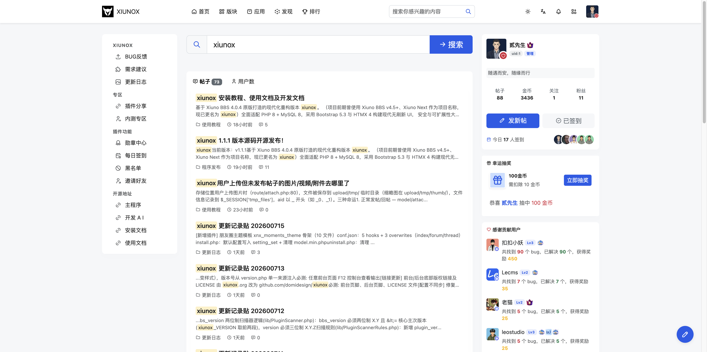

## 二、搜索

### 2.1 搜索页

**页面路径：** `/search`

**功能说明：**
通过关键词搜索帖子和用户，支持分类查看搜索结果。

**页面组成：**

| 区域 | 说明 |
|------|------|
| 搜索框 | 大号搜索输入框，输入关键词后提交搜索 |
| 帖子结果标签 | 显示帖子搜索结果及数量 |
| 用户结果标签 | 显示用户搜索结果及数量 |
| 帖子结果列表 | 显示匹配帖子的标题、摘要、版块、时间、回复数 |
| 用户结果列表 | 显示匹配用户的头像、用户名、签名，支持关注操作 |
| 分页 | 搜索结果分页 |

**操作步骤：**

1. 在搜索框中输入关键词
2. 点击搜索按钮或按回车提交搜索
3. 在「帖子」和「用户」标签页之间切换查看不同类型的结果
4. 点击帖子标题进入帖子详情
5. 点击用户名进入用户资料页
6. 在用户搜索结果中可直接关注用户

**注意事项：**
- 搜索功能可能需要登录才能使用（取决于安全配置 `security_search_require_login`）
- 关键词过短时会提示「关键词太短」
- 搜索使用 htmx 局部刷新，无需整页重载
- 未登录时搜索框显示为禁用状态

---

