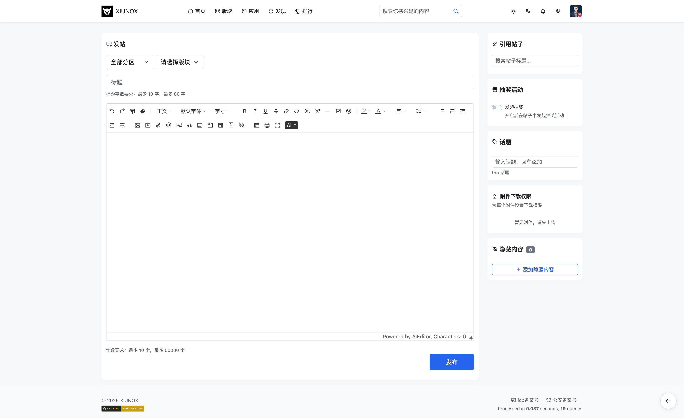

## 三、发帖与回复

### 3.1 发帖页

**页面路径：**
- 发表新帖：`/post-{fid}`（fid 为版块ID）
- 回复帖子：`/post-{tid}`（tid 为帖子ID，进入高级回复模式）
- 编辑帖子：`/post-update-{pid}`（pid 为帖子ID）

**功能说明：**
发表新帖、回复帖子或编辑已有帖子。使用 AIEditor 富文本编辑器，支持附件上传、拖拽上传、粘贴上传。

**字段说明：**

| 字段 | 类型 | 说明 | 适用场景 |
|------|------|------|----------|
| fid | 下拉选择 | 选择发帖版块（仅发新帖时显示） | 发新帖 |
| subject | 文本输入 | 帖子标题（仅发新帖时显示） | 发新帖 |
| message | 富文本编辑器 | 帖子/回复内容 | 所有场景 |
| captcha | 文本输入 | 验证码（根据安全配置显示） | 所有场景 |
| doctype | 隐藏字段 | 文档类型，默认为 0 | 所有场景 |
| quotepid | 隐藏字段 | 引用回复的帖子ID | 回复/编辑 |

**字数限制：**
- 主帖：最小长度和最大长度由安全配置 `security_post_min_length`（默认10）和 `security_post_max_length`（默认50000）控制
- 回复：最小长度由 `security_reply_min_length`（默认5）控制

**附件上传：**

| 功能 | 说明 |
|------|------|
| 拖拽上传 | 将文件拖拽到编辑器区域即可上传 |
| 粘贴上传 | 在编辑器中粘贴图片自动上传 |
| 点击上传 | 通过上传组件选择文件 |
| 图片预览 | 上传完成的图片显示缩略图预览 |
| 附件卡片 | 非图片文件显示文件类型图标、文件名、大小 |
| 删除附件 | 每个附件/图片预览右上角有删除按钮 |

**操作步骤：**

1. **发表新帖**：
   - 从版块页点击「发帖」按钮
   - 选择目标版块（下拉框）
   - 输入帖子标题
   - 在编辑器中编写内容
   - 可拖拽/粘贴/点击上传附件
   - 输入验证码（如需要）
   - 点击「发表帖子」按钮

2. **回复帖子（高级模式）**：
   - 从帖子详情页点击「高级回复」链接
   - 在编辑器中编写回复内容
   - 输入验证码（如需要）
   - 点击「发表回复」按钮

3. **编辑帖子**：
   - 从帖子详情页点击编辑图标（铅笔）
   - 修改内容
   - 点击「更新帖子」按钮

**注意事项：**
- 验证码每次提交后自动刷新
- 提交频率过高会触发限制，提交按钮会显示倒计时
- 验证码错误（code -1001）会在验证码行内显示错误提示
- 频率限制（code -1002）会禁用提交按钮并倒计时
- 发帖/回复前会清理上次遗留的临时文件
- 附件上传支持进度条显示

---

