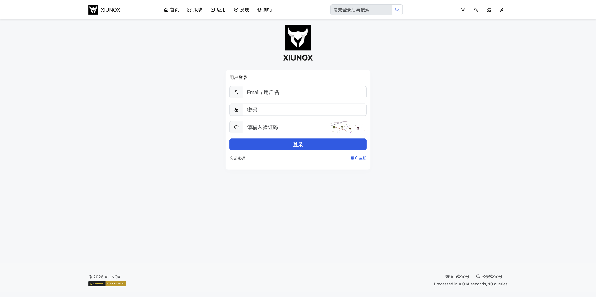
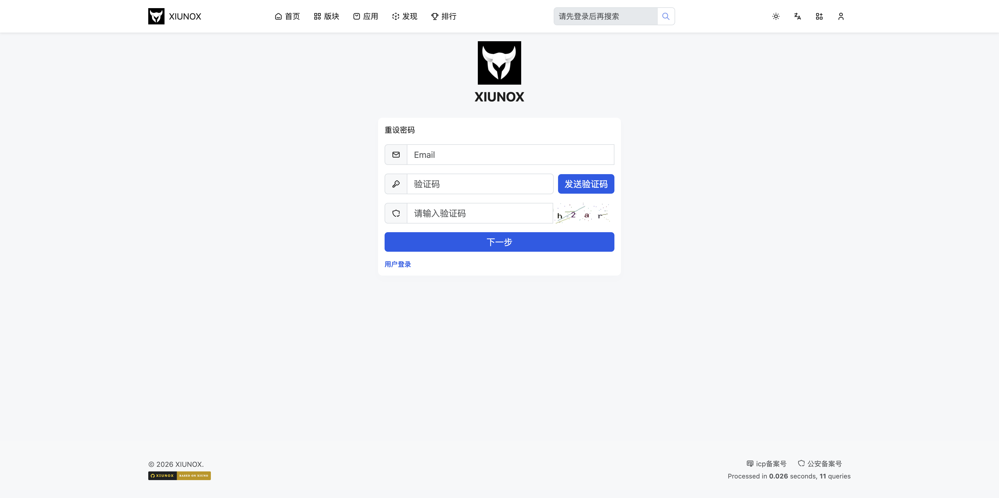
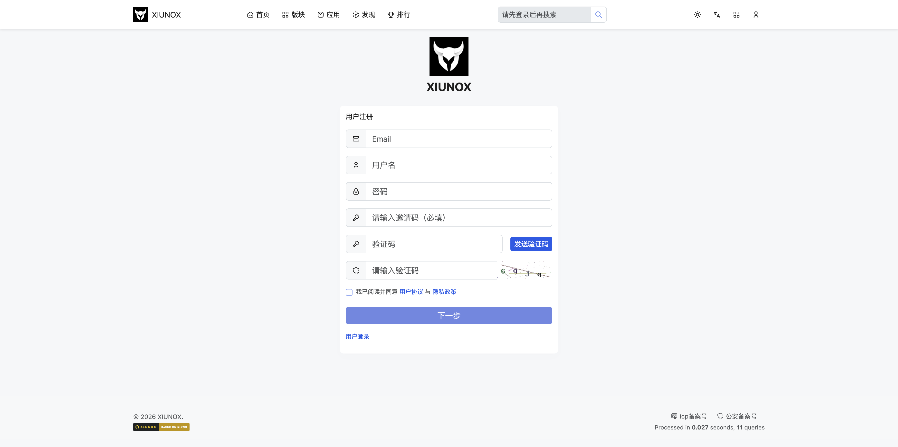

## 四、用户认证

### 4.1 登录页

**页面路径：** `/user-login`

**功能说明：**
用户登录页面，支持邮箱/用户名登录，含验证码保护。

**字段说明：**

| 字段 | 类型 | 说明 |
|------|------|------|
| email | 文本输入 | 邮箱或用户名 |
| password | 密码输入 | 登录密码 |
| captcha | 文本输入 | 验证码（根据安全配置显示） |
| next | 隐藏字段 | 登录成功后的跳转地址 |

**操作步骤：**

1. 输入邮箱或用户名
2. 输入密码
3. 输入验证码（如显示）
4. 点击「登录」按钮
5. 登录成功后自动跳转

**页面链接：**
- 「忘记密码」→ 跳转到找回密码页
- 「注册账号」→ 跳转到注册页

**注意事项：**
- 已登录用户访问登录页会自动跳转到个人中心
- 密码以明文提交，服务端处理加密
- 验证码每次提交后自动刷新
- 登录失败次数过多会触发账号锁定，所有输入框和按钮禁用并显示倒计时（默认5分钟）
- 验证码错误在验证码行内提示
- 账号锁定/频率限制（code -1002/-1003）时禁用整个表单

---

### 4.2 注册页

**页面路径：** `/user-create`

**功能说明：**
新用户注册页面，支持邮箱验证码注册。

**字段说明：**

| 字段 | 类型 | 说明 |
|------|------|------|
| email | 邮箱输入 | 注册邮箱（必填） |
| username | 文本输入 | 用户名 |
| password | 密码输入 | 设置密码 |
| code | 文本输入 | 邮箱验证码（开启邮箱验证时显示） |
| captcha | 文本输入 | 图形验证码（根据安全配置显示） |

**操作步骤：**

1. 输入注册邮箱
2. 输入用户名
3. 设置密码
4. 如开启邮箱验证：
   - 点击「发送验证码」按钮
   - 在邮箱中查收验证码
   - 输入验证码（发送成功后提交按钮自动启用）
5. 输入图形验证码（如显示）
6. 点击「下一步」按钮完成注册

**页面链接：**
- 「登录」→ 跳转到登录页

**注意事项：**
- 已登录用户访问注册页会自动跳转
- 开启邮箱验证时，提交按钮默认禁用，发送验证码成功后自动启用
- 验证码每次提交后自动刷新
- 验证码错误在验证码行内提示
- 发送邮箱验证码后有60秒冷却时间

---

### 4.3 找回密码

**页面路径：** `/user-resetpw`

**功能说明：**
通过邮箱验证码重置密码。

**字段说明：**

| 字段 | 类型 | 说明 |
|------|------|------|
| email | 文本输入 | 注册时使用的邮箱 |
| code | 文本输入 | 邮箱验证码 |
| captcha | 文本输入 | 图形验证码（根据安全配置显示） |

**操作步骤：**

1. 输入注册邮箱
2. 点击「发送验证码」按钮
3. 在邮箱中查收验证码
4. 输入验证码
5. 输入图形验证码（如显示）
6. 点击「下一步」按钮
7. 验证成功后进入密码重置流程

**页面链接：**
- 「登录」→ 跳转到登录页

**注意事项：**
- 需要站点开启邮箱功能（`user_resetpw_on` 配置项）
- 开启邮箱验证时提交按钮默认禁用
- 验证码每次提交后自动刷新
- 发送邮箱验证码需先填写邮箱地址

### 4.4 密码重置完成

**页面路径：** `/user-resetpw-complete`

**功能说明：**
密码重置成功后的确认页面，提示用户密码已修改，可使用新密码登录。

**操作步骤：**

1. 在找回密码流程中设置新密码后自动跳转到此页面
2. 点击「前往登录」按钮跳转到登录页

**注意事项：**
- 此页面仅作提示用途，无法从此页面进行其他操作
- 如果未经过密码重置流程直接访问此页面，会显示错误提示

---

