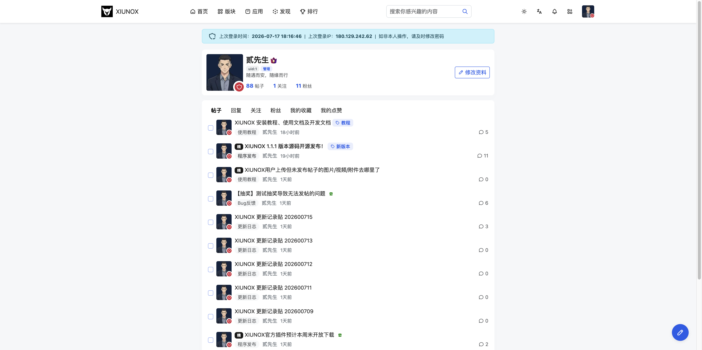

## 五、用户资料（查看他人）

### 5.1 用户资料页

**页面路径：** `/user-{uid}`（uid 为用户ID）

**功能说明：**
查看其他用户的基本信息、帖子、回复、关注/粉丝列表。查看自己的资料页时额外显示收藏和点赞标签。

**页面组成：**

| 区域 | 说明 |
|------|------|
| 用户信息卡 | 头像、用户名、用户组徽章、签名、帖子数、粉丝数、关注数 |
| 关注/编辑按钮 | 他人资料页显示关注按钮；自己的资料页显示「编辑资料」按钮 |
| 安全提示 | 自己的资料页显示上次登录时间和IP |
| 标签页 | 帖子/回复/关注/粉丝（自己的还有收藏/点赞） |

**标签页说明：**

| 标签 | 路径 | 说明 |
|------|------|------|
| 帖子 | `/user-thread-{uid}` | 该用户发表的帖子列表 |
| 回复 | `/user-post-{uid}` | 该用户发表的回复列表 |
| 关注 | `/user-following-{uid}` | 该用户关注的人列表 |
| 粉丝 | `/user-followers-{uid}` | 该用户的粉丝列表 |
| 收藏 | `/user-favorite-{uid}` | 该用户收藏的帖子（仅自己可见） |
| 点赞 | `/user-like-{uid}` | 该用户点赞的内容（仅自己可见） |

**操作步骤：**

1. 点击用户名或头像进入用户资料页
2. 默认展示该用户的帖子列表
3. 点击标签页切换查看不同内容（回复、关注、粉丝等使用懒加载）
4. 关注/取消关注用户（点击关注按钮，乐观更新）
5. 查看自己的资料页时可点击「编辑资料」跳转到个人中心

**注意事项：**
- 回复/关注/粉丝标签页使用 htmx 懒加载，首次点击时才请求数据
- 收藏和点赞标签仅自己可见
- 标签页切换支持 URL hash 路由（如 `#following`）
- 关注按钮使用乐观更新，点击即时反馈

---

