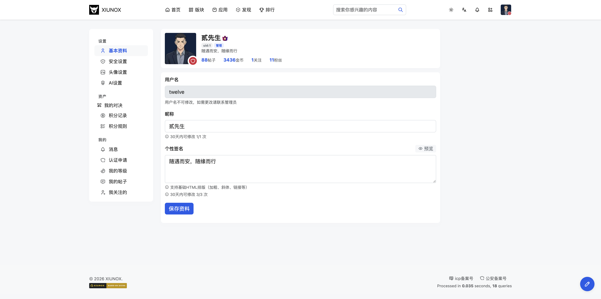
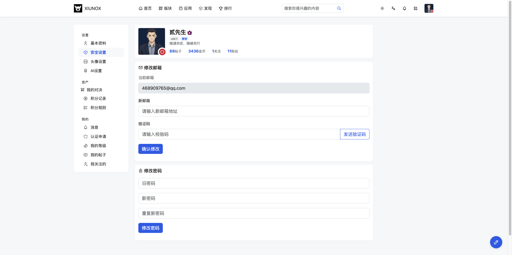
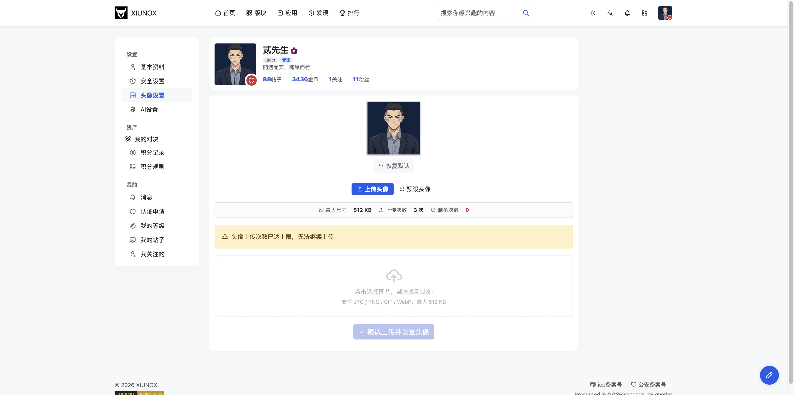
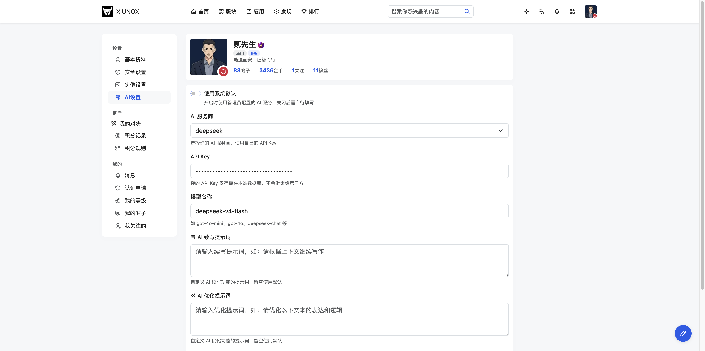
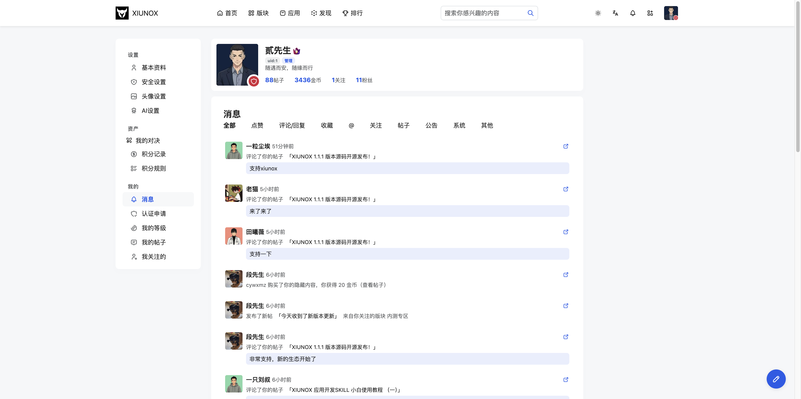
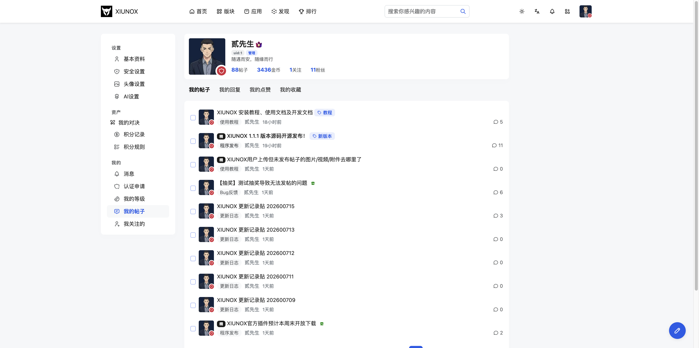
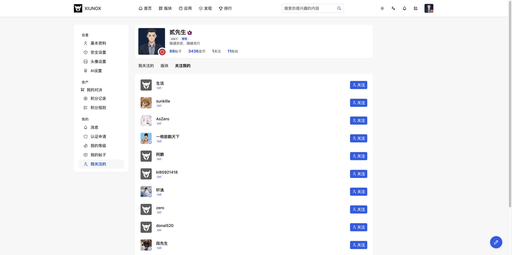

## 六、个人中心（自己）

### 6.1 个人中心首页

**页面路径：** `/my`

**功能说明：**
个人中心是用户管理个人资料、安全设置、头像、AI配置、积分记录的综合页面。采用左侧导航 + 右侧内容的布局，移动端自动切换为顶部标签导航。

**页面组成：**

| 区域 | 说明 |
|------|------|
| 用户信息卡 | 头像、用户名、用户组、签名、帖子数、积分、关注/粉丝数 |
| 左侧导航 | 基本资料、安全设置、头像设置、AI设置、积分记录、积分规则、通知、我的等级、我的主题、我的关注（共 10 项，分 3 组） |
| 移动端标签 | 桌面端隐藏，移动端显示为顶部标签导航 |

**导航项说明：**

导航项分为三组：

**个人设置**
| 导航项 | Tab ID | 说明 |
|--------|--------|------|
| 基本资料 | profile | 修改昵称和签名 |
| 安全设置 | security | 修改邮箱和密码 |
| 头像设置 | avatar | 上传/选择头像 |
| AI设置 | ai | 配置个人AI功能 |

**资产**
| 导航项 | Tab ID | 说明 |
|--------|--------|------|
| 积分记录 | credits | 查看积分变动流水 |
| 积分规则 | credits_rules | 查看积分获取规则 |

**我的中心**
| 导航项 | Tab ID | 说明 |
|--------|--------|------|
| 通知 | notice | 跳转到通知页面 |
| 我的等级 | level | 查看用户等级与积分等级 |
| 我的主题 | thread | 查看我发表的帖子 |
| 我的关注 | following | 查看关注的人/版块和粉丝 |

**基本资料表单：**

| 字段 | 类型 | 说明 |
|------|------|------|
| username | 文本输入 | 昵称 |
| signature | 文本域 | 个性签名，下方实时预览 |

**操作步骤：**

1. 访问 `/my` 进入个人中心
2. 点击左侧导航切换不同设置面板
3. 修改基本资料后点击「保存资料」
4. 支持 URL hash 定位（如 `/my#avatar` 直接打开头像设置）

**注意事项：**
- 个人中心各 Tab 使用前端切换，无需整页刷新
- URL hash 变化会同步更新，支持浏览器前进/后退

---

### 6.2 修改密码

**页面路径：** `/my` → 安全设置 Tab（`#security`）

**功能说明：**
在个人中心的安全设置面板中修改登录密码和邮箱。

**修改邮箱表单：**

| 字段 | 类型 | 说明 |
|------|------|------|
| 当前邮箱 | 只读 | 显示当前绑定的邮箱 |
| email_new | 邮箱输入 | 新邮箱地址 |
| email_code | 文本输入 | 邮箱验证码，点击「发送验证码」获取 |

**修改密码表单：**

| 字段 | 类型 | 说明 |
|------|------|------|
| password_old | 密码输入 | 当前密码 |
| password_new | 密码输入 | 新密码 |
| password_new_repeat | 密码输入 | 确认新密码 |

**操作步骤：**

1. 在个人中心点击「安全设置」
2. **修改邮箱**：
   - 输入新邮箱地址
   - 点击「发送验证码」
   - 输入收到的验证码
   - 点击「确认修改」
3. **修改密码**：
   - 输入当前密码
   - 输入新密码
   - 再次输入新密码确认
   - 点击「修改密码」

**注意事项：**
- 发送邮箱验证码后有60秒冷却时间
- 密码以明文提交，服务端处理加密
- 修改邮箱需要验证码确认

---

### 6.3 修改头像

**页面路径：** `/my` → 头像设置 Tab（`#avatar`）

**功能说明：**
上传自定义头像或选择预设头像，支持拖拽上传和点击上传。

**页面组成：**

| 区域 | 说明 |
|------|------|
| 当前头像 | 显示当前头像，支持恢复默认 |
| 上传头像 Tab | 拖拽/点击上传自定义图片 |
| 预设头像 Tab | 选择系统预设头像 |

**操作步骤：**

1. 在个人中心点击「头像设置」
2. **上传自定义头像**：
   - 点击上传区域选择图片文件，或直接拖拽图片到上传区域
   - 支持格式：JPEG、PNG、GIF、WebP、BMP
   - 上传前显示预览
   - 点击「确认上传头像」按钮
3. **选择预设头像**：
   - 切换到「预设头像」标签页
   - 点击喜欢的预设头像
   - 确认使用
4. **恢复默认头像**：
   - 点击当前头像下方的「恢复默认」按钮
   - 确认操作

**注意事项：**
- 上传图片大小限制为 5MB
- 上传的头像会自动裁剪为 128×128 像素
- 预设头像来源于 `view/img/avatars/` 目录

---

### 6.4 AI设置

**页面路径：** `/my` → AI设置 Tab（`#ai`），或 `/user-ai-setting`

**功能说明：**
配置个人 AI 功能的接口参数，支持多个 AI 服务商。

**字段说明：**

| 字段 | 类型 | 说明 |
|------|------|------|
| ai_provider | 下拉选择 | AI 服务商 |
| ai_apikey | 密码输入 | API Key |
| ai_endpoint | 文本输入 | API 接口地址 |
| ai_model | 文本输入 | 模型名称 |

**支持的 AI 服务商：**

| 服务商 | 默认接口地址 | 默认模型 |
|--------|-------------|----------|
| OpenAI (ChatGPT) | `https://api.openai.com` | `gpt-4o-mini` |
| DeepSeek | `https://api.deepseek.com` | `deepseek-chat` |
| Gitee AI | `https://ai.gitee.com/api/inference/serverless/` | - |
| 讯飞星火 | - | `v3.5` |
| 文心一言 | - | - |
| 自定义 | - | - |

**操作步骤：**

1. 在个人中心点击「AI设置」
2. 选择 AI 服务商（选择后自动填充默认接口地址和模型名称）
3. 输入 API Key
4. 确认或修改接口地址
5. 确认或修改模型名称
6. 点击「保存设置」

**注意事项：**
- 切换服务商时，如果接口地址和模型名称为空，会自动填充默认值
- API Key 以密码形式输入，不会明文显示
- AI 设置同时可在用户资料页的 AI 设置标签中访问

---

### 6.5 我的通知

**页面路径：** `/my-notice`

**功能说明：**
查看系统通知、互动通知（点赞、回复、关注、收藏、@提及等），支持标记已读和全部已读。

**页面组成：**

| 区域 | 说明 |
|------|------|
| 标题栏 | 显示「通知」标题和「全部标记已读」按钮（有未读时显示） |
| 通知分类标签 | 按类型筛选通知 |
| 通知列表 | 通知卡片列表，未读通知高亮显示 |

**通知类型：**

| 来源 | 类型 | 说明 |
|------|------|------|
| notify | like | 赞了你的帖子 |
| notify | reply | 回复了你的评论 |
| notify | follow | 关注了你 |
| notify | favorite | 收藏了你的帖子 |
| notify | thread | 发布了新帖 |
| notify | forum_post | 发布了新帖 |
| notify | mention | 提及了你 |
| notice | 1 | 发布了公告 |
| notice | 2 | 评论了 |
| notice | 3 | 系统通知 |

**通知卡片内容：**

| 元素 | 说明 |
|------|------|
| 发送者头像 | 通知发送者的头像 |
| 发送者用户名 | 可点击进入用户资料页 |
| 时间 | 通知时间 |
| 操作描述 | 如「赞了你的帖子」「回复了你的评论」 |
| 帖子链接 | 关联的帖子标题，可点击跳转 |
| 引用内容 | 回复通知显示你的原评论 |
| 回复内容 | 回复通知显示对方的回复内容 |
| 标已读按钮 | 未读通知显示勾选图标 |
| 查看按钮 | 有链接的通知显示外链图标 |

**操作步骤：**

1. 访问通知页面查看所有通知
2. 点击通知分类标签筛选特定类型
3. 点击通知卡片自动标记为已读
4. 点击「标已读」按钮单独标记某条通知
5. 点击「全部标记已读」一键标记所有未读通知
6. 点击帖子链接跳转到相关帖子

**注意事项：**
- 点击通知卡片任何位置都会自动标记已读
- 标记已读后卡片取消高亮，标已读按钮消失
- 全部标记已读后按钮自动隐藏
- 通知列表支持分页

### 6.6 我的帖子

**页面路径：** `/my-thread`

**功能说明：**
查看自己发表的所有帖子列表，支持分页浏览。

**操作步骤：**

1. 从个人中心或导航菜单进入「我的帖子」
2. 浏览帖子列表，点击帖子标题进入详情页
3. 可通过分页导航查看更多帖子

**注意事项：**
- 仅显示自己发表的帖子（主帖），不含回复
- 帖子按发帖时间倒序排列

---

### 6.7 我的动态

**页面路径：** `/my-feed`

**功能说明：**
查看已关注用户发布的最新帖子动态，类似社交媒体的信息流。

**操作步骤：**

1. 从个人中心或导航菜单进入「我的动态」
2. 浏览关注用户的帖子动态
3. 点击帖子标题进入详情页

**注意事项：**
- 需要关注至少一个用户才会有动态内容
- 动态按发帖时间倒序排列
- 未登录用户无法访问此页面

---

### 6.8 我的收藏

**页面路径：** `/my-favorite`

**功能说明：**
查看自己收藏的帖子列表，方便快速找到感兴趣的内容。

**操作步骤：**

1. 从个人中心或导航菜单进入「我的收藏」
2. 浏览收藏的帖子列表
3. 点击帖子标题进入详情页
4. 可在帖子详情页取消收藏

**注意事项：**
- 收藏列表仅自己可见
- 取消收藏需在帖子详情页操作

---

### 6.9 我的消息

**页面路径：** `/my-notify`

**功能说明：**
查看未读消息提醒的数量和类型，是通知页面的快捷入口。

**操作步骤：**

1. 从导航栏的消息图标进入
2. 查看各类未读消息数量
3. 点击对应类型跳转到通知页面

**注意事项：**
- 导航栏消息图标显示未读数量角标
- 消息提醒包含点赞、回复、关注、收藏、@提及等类型

---

### 6.10 我的等级

**页面路径：** `/my-level`

**功能说明：**
查看当前用户等级和积分等级。

**页面组成：**
- 当前等级卡片（图标、名称、积分）
- 进度条显示到下一级的距离
- 系统组（管理员/版主）显示不参与升级提示

---

### 6.11 我的关注

**页面路径：** `/my-following`

**功能说明：**
查看和管理关注列表，含 3 个内部 tab。

**标签页说明：**

| 标签 | URL 参数 | 说明 |
|------|----------|------|
| 我关注的人 | ?tab=user | 已关注的用户列表 |
| 我关注的版块 | ?tab=forum | 已关注的版块列表 |
| 我的粉丝 | ?tab=follower | 关注我的用户列表 |

**操作步骤：**
1. 在个人中心点击「我的关注」
2. 切换 tab 查看不同列表
3. 在列表中点击关注/取关按钮（hx-optimistic 乐观更新）

**注意事项：**
- tab 切换使用 URL 参数，支持浏览器前进/后退
- 关注/取关使用乐观更新即时反馈

---

