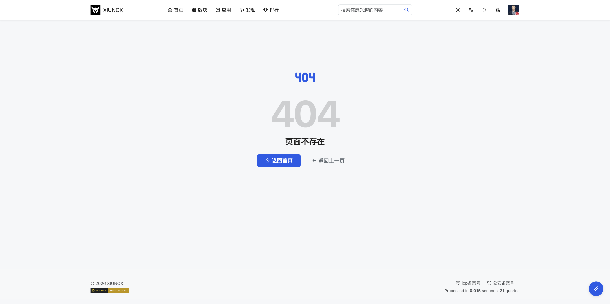
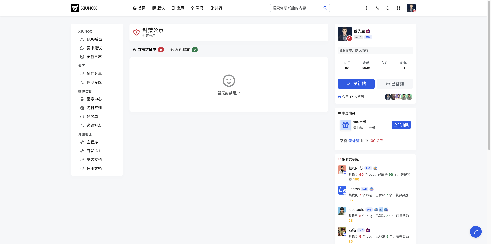

## 八、其他

### 8.1 主题切换

**页面路径：** `/theme`

**功能说明：**
切换论坛的明亮/暗黑主题模式。

**页面组成：**

| 区域 | 说明 |
|------|------|
| 主题预览卡片 | 两个并排的主题预览，显示配色效果 |
| 当前主题标记 | 当前使用的主题卡片右上角显示蓝色勾选徽章 |

**操作步骤：**

1. 访问主题设置页面
2. 点击想要使用的主题卡片（明亮/暗黑）
3. 主题立即生效，同时保存到本地存储和服务端

**注意事项：**
- 主题选择即时生效，无需刷新页面
- 主题偏好保存在 `localStorage` 中，下次访问自动应用
- 同时会异步保存到服务端（用户登录状态下）
- 导航栏的主题切换图标也会同步更新

---

### 8.2 错误页

**页面路径：** 系统自动跳转

**功能说明：**
当用户访问不存在的页面或操作出错时，系统自动显示错误页面，包含错误代码和错误信息。

**页面组成：**

| 区域 | 说明 |
|------|------|
| 错误代码 | 显示具体的错误编号 |
| 错误信息 | 用通俗易懂的语言描述错误原因 |
| 返回按钮 | 提供返回上一页或首页的链接 |

**常见错误场景：**
- 访问不存在的帖子或版块
- 权限不足的操作
- 请求参数错误

**注意事项：**
- 错误页由系统自动生成，用户无法直接访问
- 如频繁出现错误，建议联系管理员

---

### 8.3 消息页

**页面路径：** 系统自动跳转

**功能说明：**
操作反馈页面，在用户执行操作后（如发帖成功、修改资料成功等）显示操作结果，通常自动跳转或提供继续操作的链接。

**页面组成：**

| 区域 | 说明 |
|------|------|
| 操作结果 | 显示操作成功或失败的提示信息 |
| 跳转链接 | 提供跳转到相关页面的链接 |
| 自动跳转 | 部分场景下自动倒计时跳转 |

**注意事项：**
- 消息页是系统中间页面，通常在几秒后自动跳转
- 如果未自动跳转，可手动点击链接

---

### 8.4 浏览器兼容提示

**页面路径：** 系统自动检测跳转

**功能说明：**
当用户使用过时的浏览器访问论坛时，系统自动显示兼容性提示页面，建议用户升级浏览器。

**注意事项：**
- 此页面仅在检测到不兼容浏览器时自动显示
- 建议使用 Chrome、Firefox、Safari、Edge 等现代浏览器的最新版本
- Xiuno BBS 使用现代 Web 技术（htmx 4.x、Bootstrap 5.3+），不支持 IE 浏览器

---

### 8.5 封禁提示页

**页面路径：** `/banned-notice`

**功能说明：**
被封禁用户访问站点时显示的封禁状态页面，区分禁言（`ti-lock-off`）和禁止访问（`ti-lock`）两种状态。

**页面组成：**

| 区域 | 说明 |
|------|------|
| 封禁状态图标 | 禁言 / 禁止访问 / 锁定 |
| 封禁信息 | 封禁类型、原因、到期时间 |
| 倒计时 | 如有到期时间则显示剩余时间 |
| 申诉引导 | 引导用户申诉 |
| 登出按钮 | 退出登录 |

**注意事项：**
- 此页面仅在用户被封禁时自动显示
- 禁言用户可浏览但不可发帖/回复
- 禁止访问用户无法进入任何页面

---

